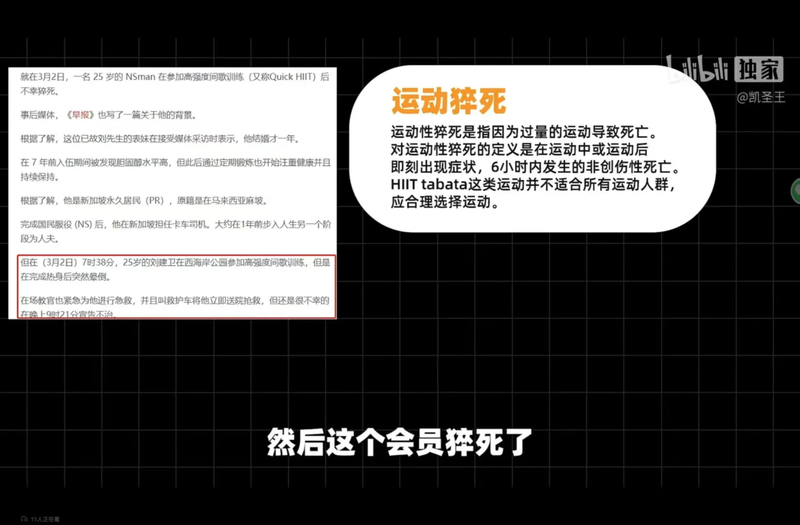
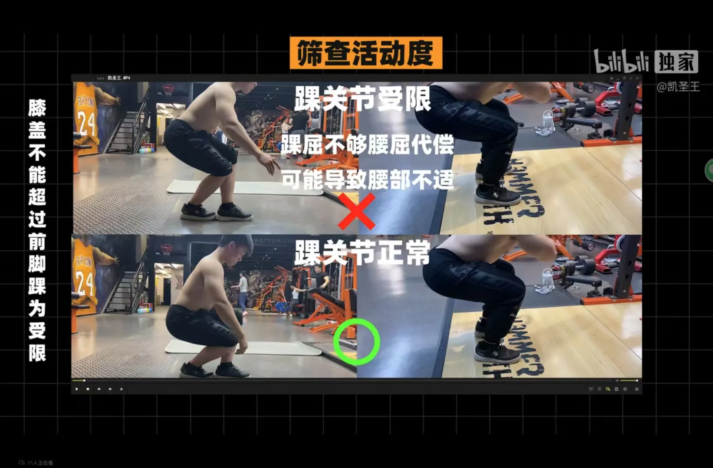
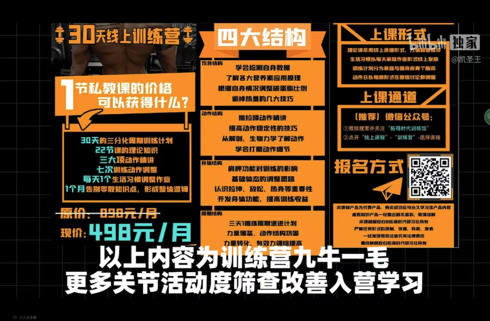

# day4 新手入门 一分化训练

[【新手入门】帮你省去50节私教费！一分化训练 理论+计划+讲解](https://www.bilibili.com/video/BV14v4y1G7A3)

# 提高心肺功能

有氧是一切运动的基础

防止低血糖

运动中低血糖

大体重可以游泳 慢走 到快走

心肺 50 - 60 即可

220 - 年龄是最大心率

最大心率 118即可

基础问题筛查

左腿 后交叉韧带断裂

# 熟悉动作模式

