# day2饮食计划

# 苏欣昊的饮食计划

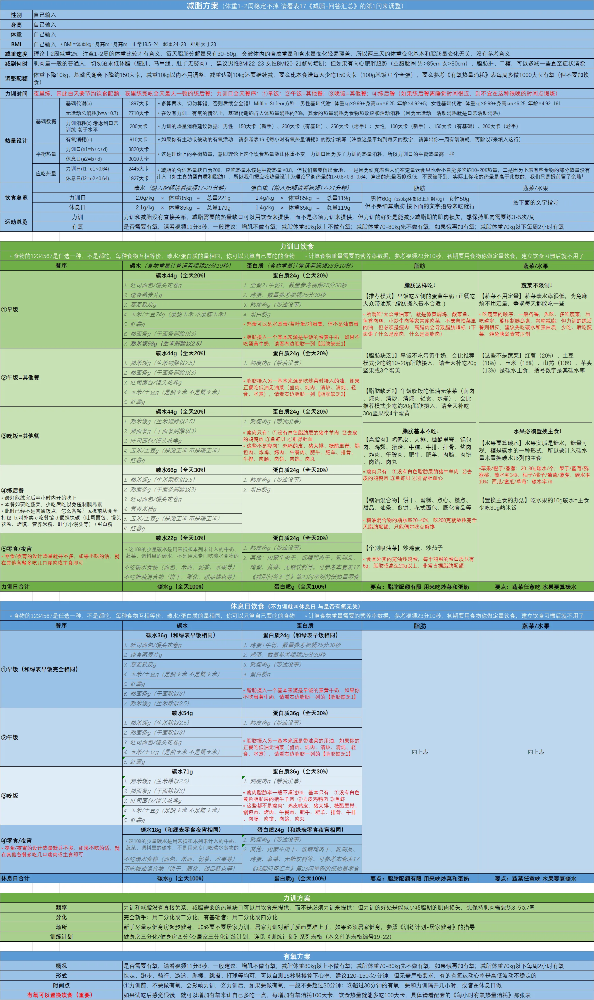

视频来源：

[饮食计划 好人松松](https://www.bilibili.com/video/BV1zu4m1N76R)

<a href="./【可任意分享】健身Excel超级套表（作者：B站好人松松）25年8月最新版.xlsx">
excel饮食计划表</a>

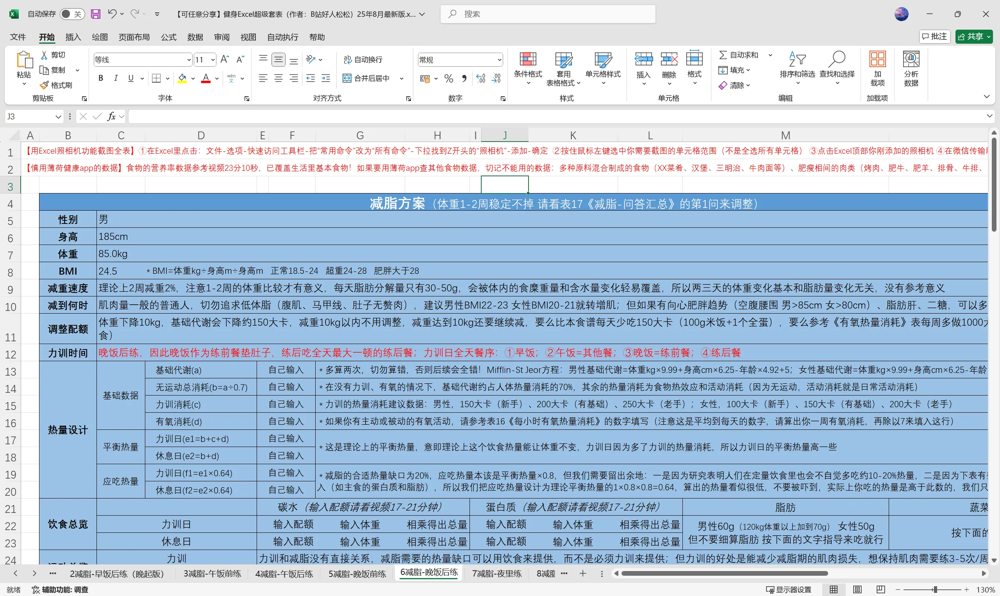

# 1 饮食热量设计

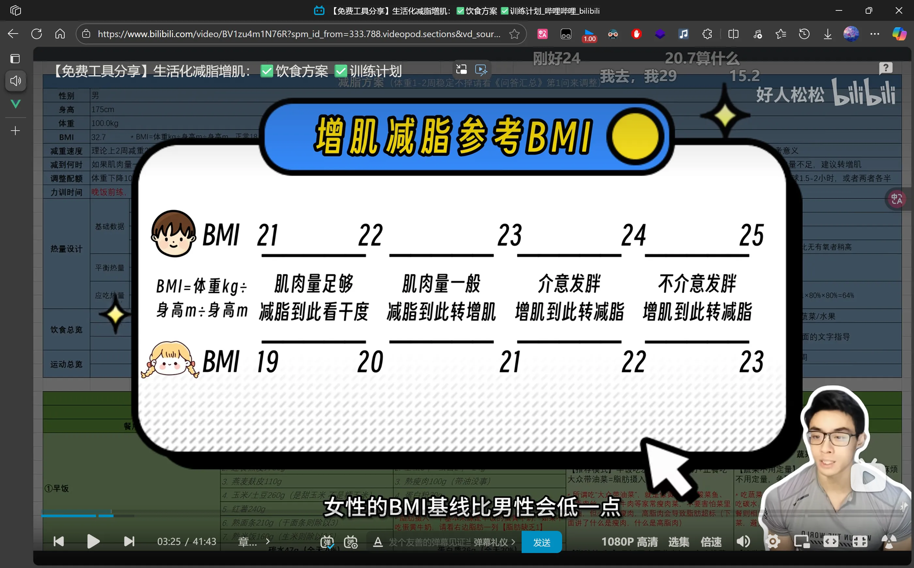

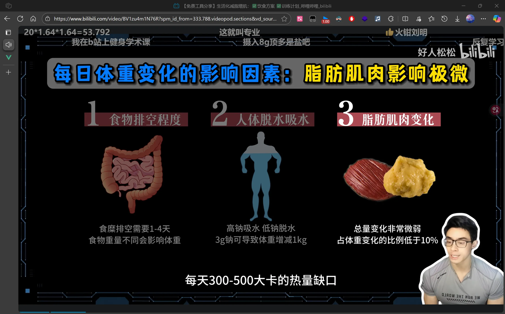

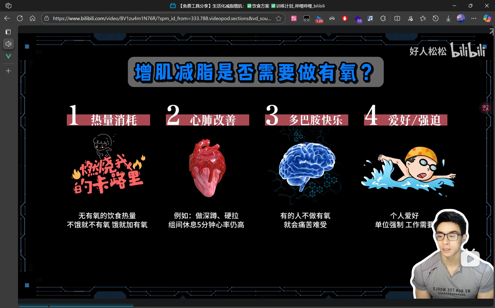

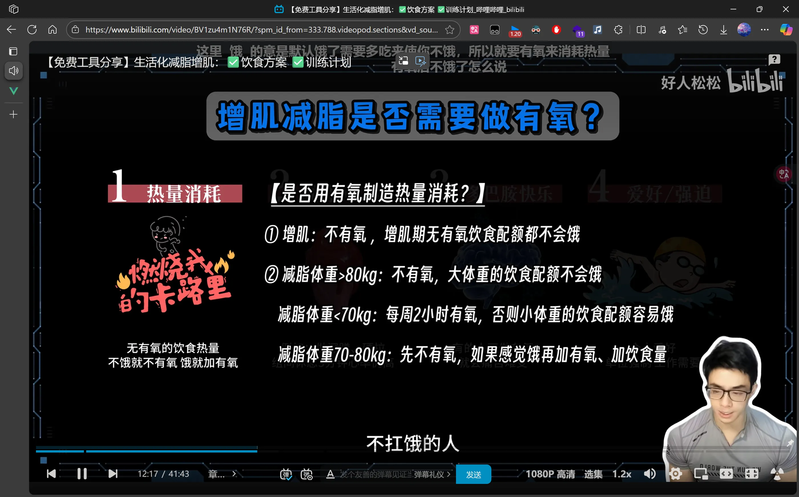

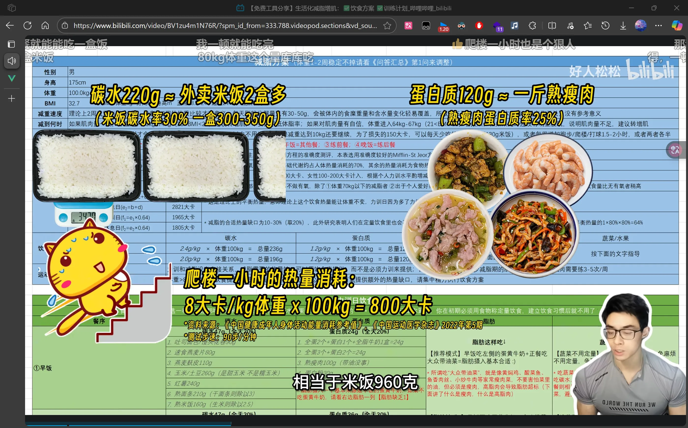

## 应吃热量按照 4 4 9 分配给 碳水 蛋白质 脂肪

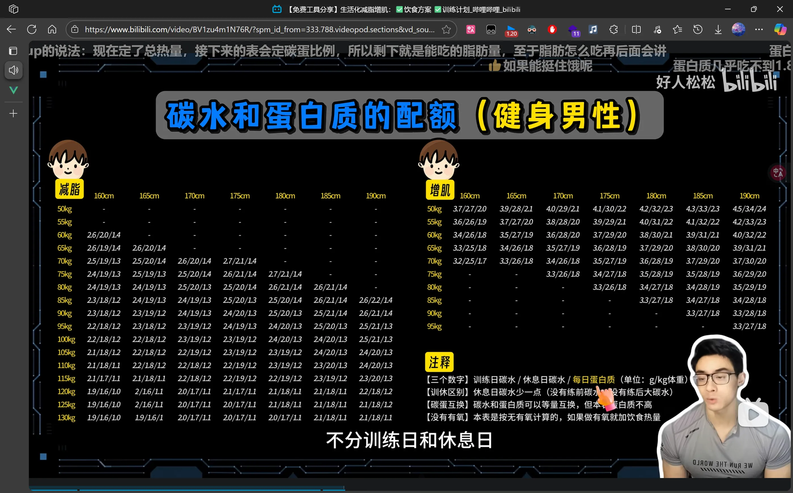

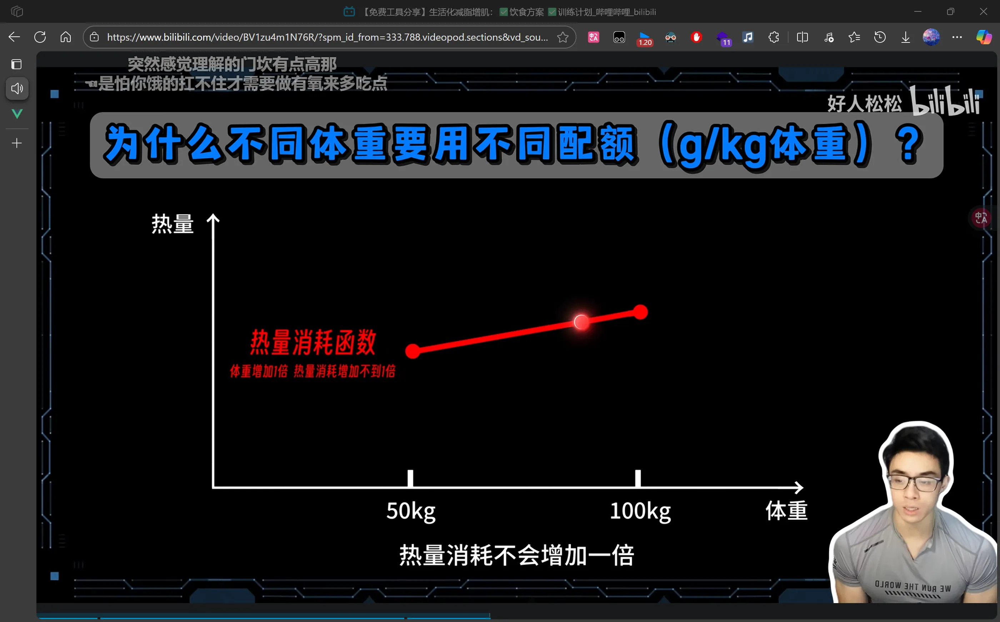

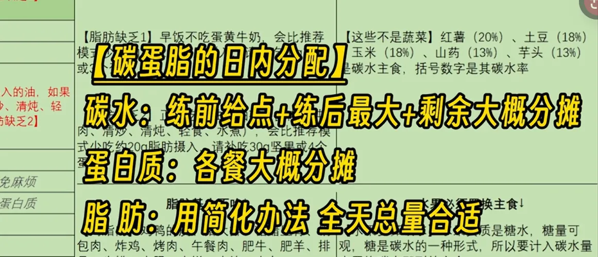

碳水比率

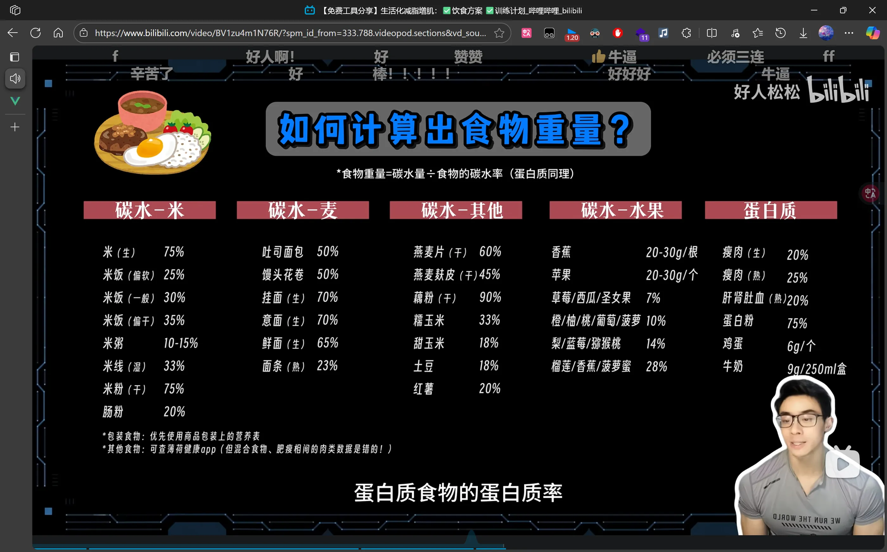

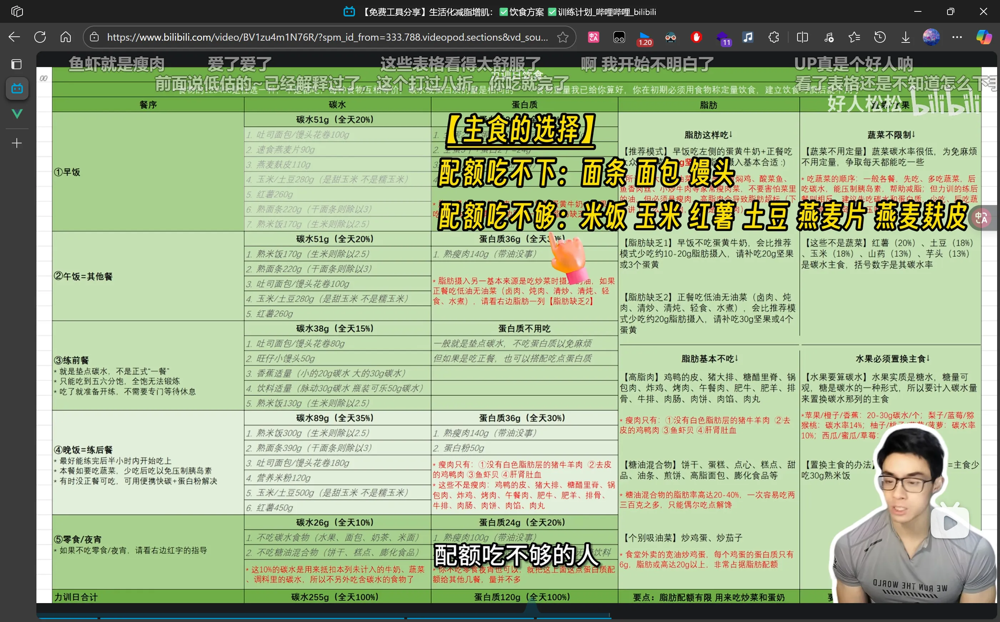

## 减脂期多吃玉米 红薯 米饭

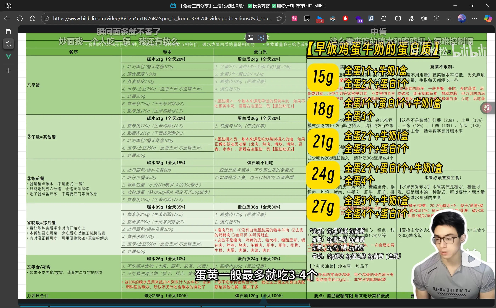

## 什么是瘦肉

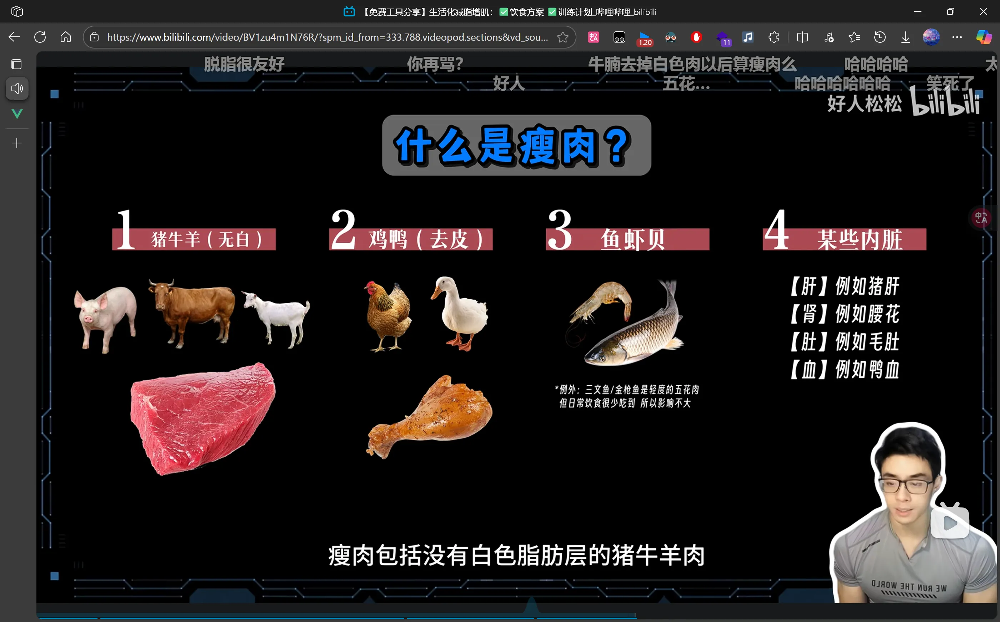

## 什么不算瘦肉

鸡皮 鸭皮 40% 

肥肉 90%

油炸类 糖醋里脊 锅包肉

预制品 肉肠 肉丸 午餐肉 肉馅 肉饼 （都是五花肉打碎）

潮汕牛肉丸 15%脂肪

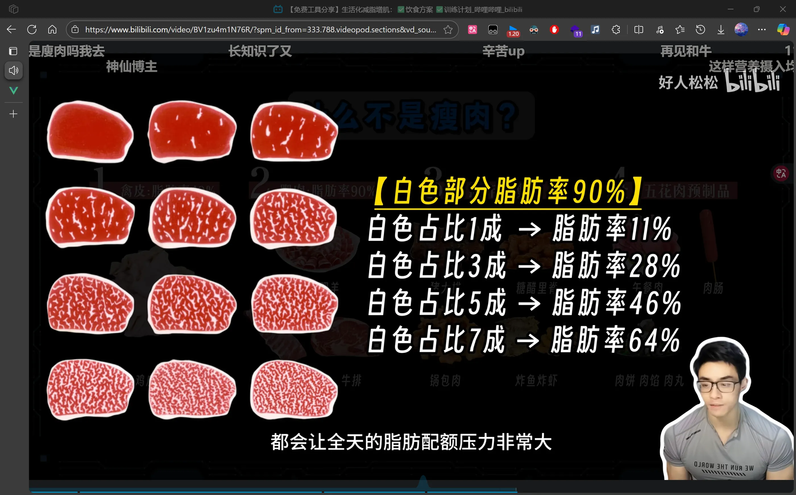

### 注意 五花肉不能作为基础食物

## 推荐模式 【推荐模式】早饭吃左侧的蛋黄牛奶+正餐吃大众带油菜=脂肪摄入基本合适 :)

55-65g

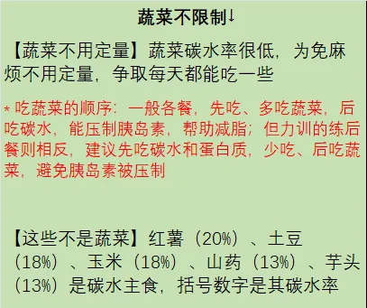

训练后摄入碳水的重要性
力量训练会消耗我们肌肉和肝脏中储存的糖原。糖原是身体最主要的能量来源之一，尤其是在高强度运动时。训练后，这些糖原储备会被大量消耗，因此需要及时补充。

训练后立刻摄入碳水化合物，主要有两个目的：

补充糖原：及时补充糖原可以帮助肌肉快速恢复，为下一次训练提供充足的能量储备。

促进蛋白质合成：训练后，肌肉会处于一个分解代谢的状态，需要通过摄入蛋白质来修复和生长。而碳水化合物的摄入会引起胰岛素水平的升高，胰岛素是一种非常重要的合成激素。它能像一把钥匙，打开细胞大门，将血液中的葡萄糖和氨基酸（蛋白质的分解产物）送入肌肉细胞中。这不仅能帮助肌肉快速补充能量，还能促进肌肉蛋白质的合成，抑制肌肉分解。

这就是为什么训练后餐需要优先摄入碳水和蛋白质的原因。因为你的主要目标是快速补充糖原和促进肌肉修复，而胰岛素在这个过程中起到了关键的“搬运工”作用。

## 脂肪缺乏

### 【脂肪缺乏1 避坑】早饭不吃蛋黄牛奶，会比推荐模式少吃约10-20g脂肪摄入，请全天补吃20g坚果或3个蛋黄 脂肪为什么会缺乏，难道不是吃的越少越好？

### 【脂肪缺乏2 避坑】午饭晚饭吃低油无油菜（卤肉、炖肉、清炒、清炖、轻食、水煮），会比推荐模式少吃约20g脂肪摄入，请全天补吃30g坚果或4个蛋黄

提供能量：脂肪是身体重要的能量来源，每克脂肪能提供9千卡的热量，是碳水化合物和蛋白质的两倍多。在低强度运动和日常活动中，身体主要依靠脂肪来提供能量。

构建细胞膜和激素：脂肪是构成我们身体所有细胞膜的基本成分，没有脂肪，细胞就无法正常工作。此外，像睾酮和雌激素这类重要的合成代谢激素，其主要原料就是胆固醇（一种脂肪）。如果脂肪摄入不足，激素水平可能会受到影响，进而影响肌肉生长、力量提升和内分泌健康。

帮助吸收维生素：维生素A、D、E、K都是脂溶性维生素，它们需要脂肪的帮助才能被身体吸收和利用。如果你饮食中的脂肪太少，即使你吃了富含这些维生素的食物，身体也无法有效地吸收它们。

保护内脏和维持体温：脂肪在身体里还起到了绝缘和缓冲的作用，能够保护我们的重要器官，并在寒冷环境中帮助维持体温。

脂肪缺乏的风险
当你为了减重而过度限制脂肪摄入时，可能会出现以下问题：

激素失衡：特别是对男性和女性的生殖健康以及肌肉生长非常重要。

皮肤和头发问题：皮肤干燥、脱发等。

免疫力下降：身体抵抗力变弱。

持续的饥饿感：脂肪的消化速度较慢，能提供更持久的饱腹感，如果缺乏，你可能会更容易感到饥饿。

# 不推荐的多脂肪的食物：

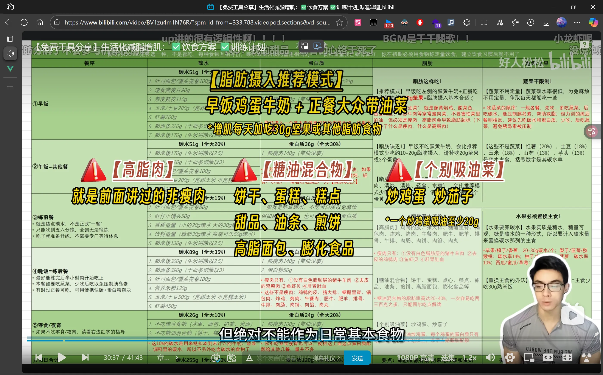

炒鸡蛋 炒茄子 蛋挞 油条 星巴克糕点 食堂外卖宽油炒鸡蛋

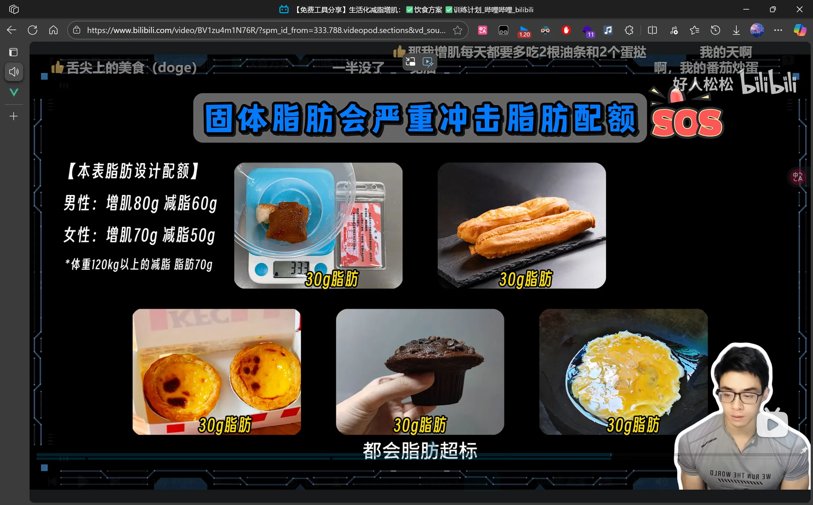

不能作为基本食物

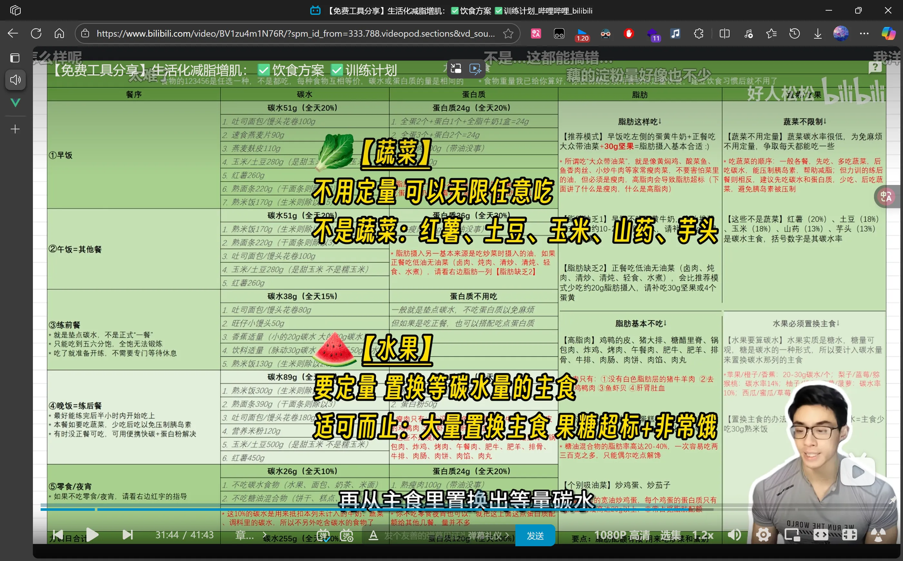

减脂期吃水果一方面糖分超标，另一方面饱腹感弱，会极大影响饮食

# 非力训日

不要合并两餐

# 苏欣昊的饮食计划

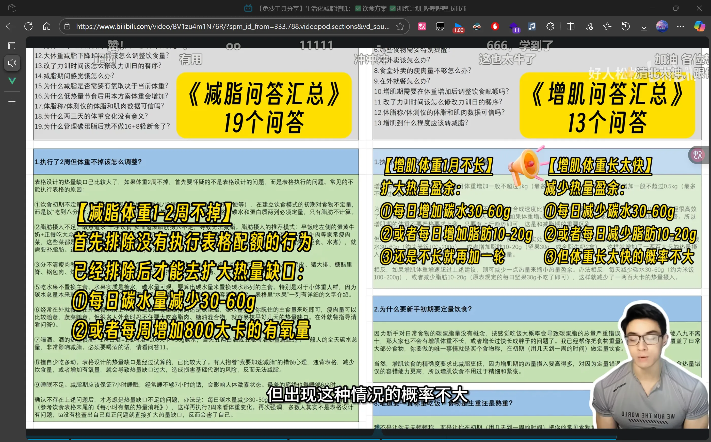

# 如果1-2周体重不掉 增加200-300热量缺口

例如碳水减少30-60

或者每周增加800k的有氧

# 分化方式

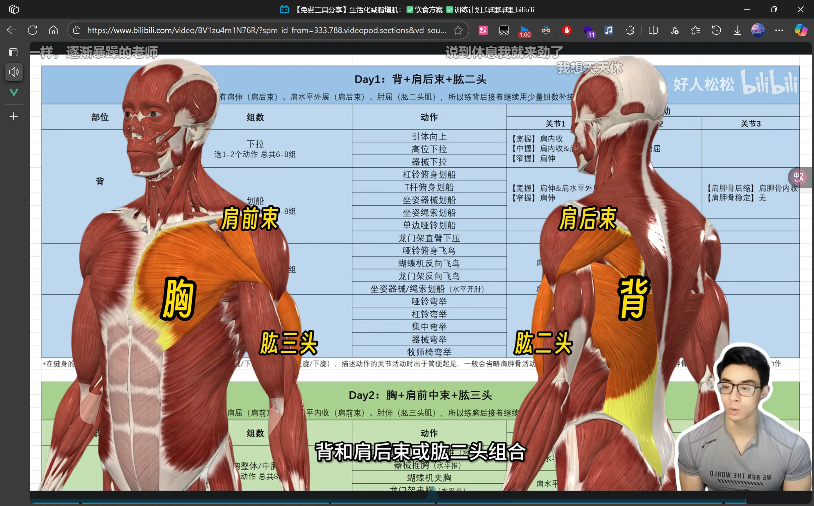

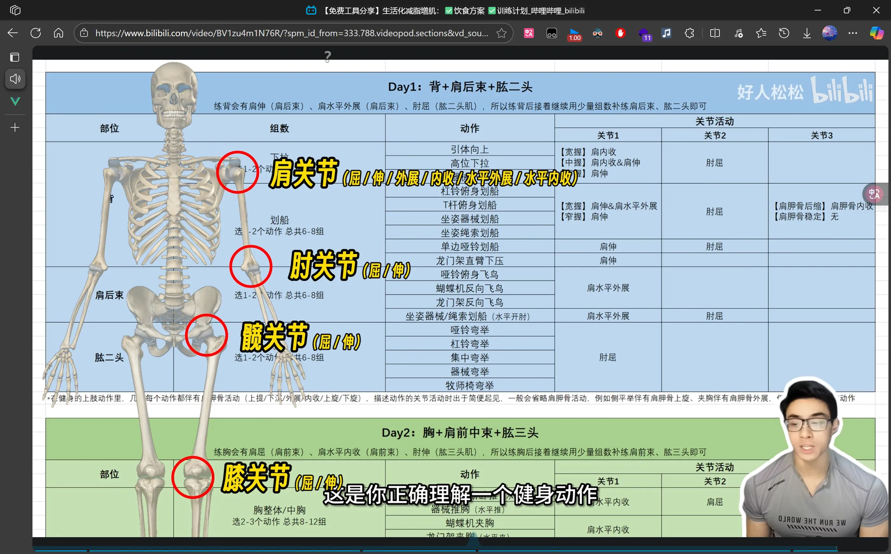

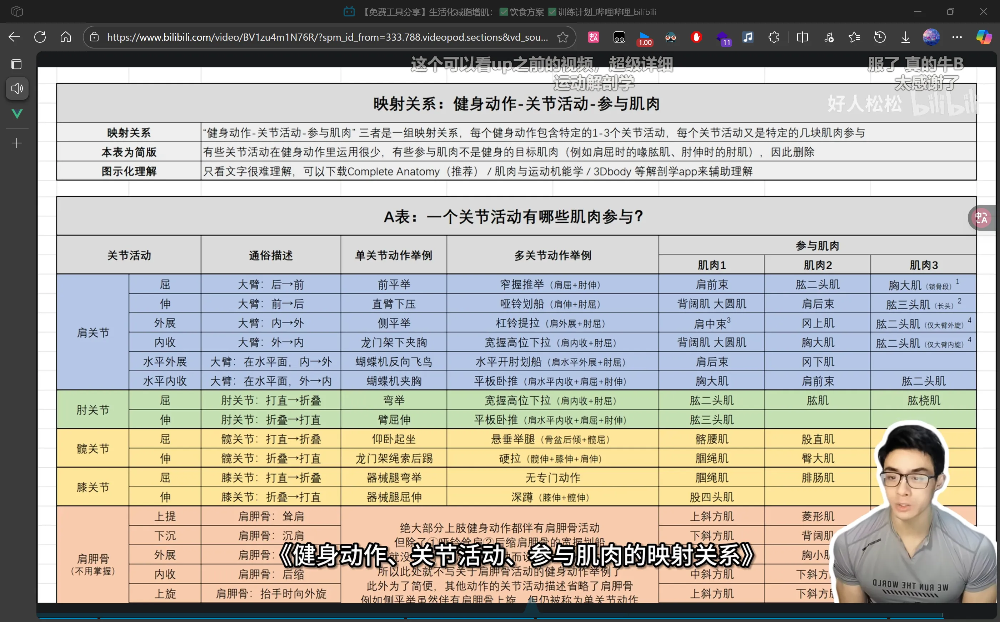

