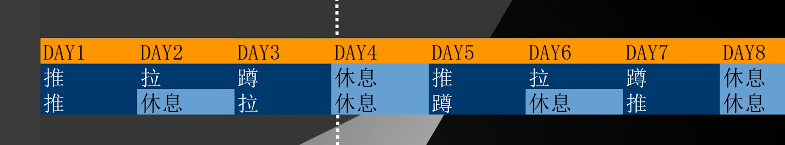
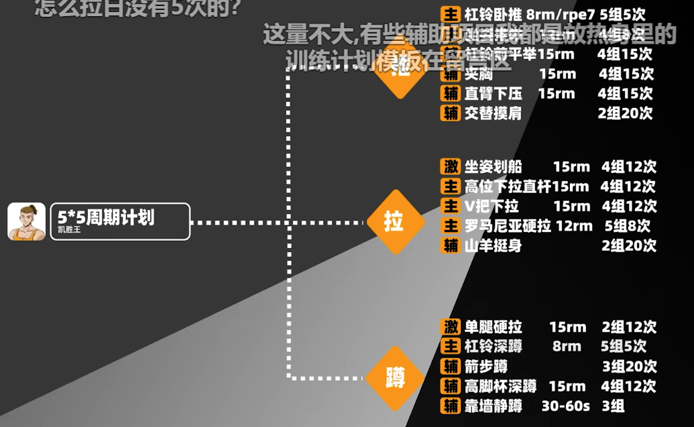
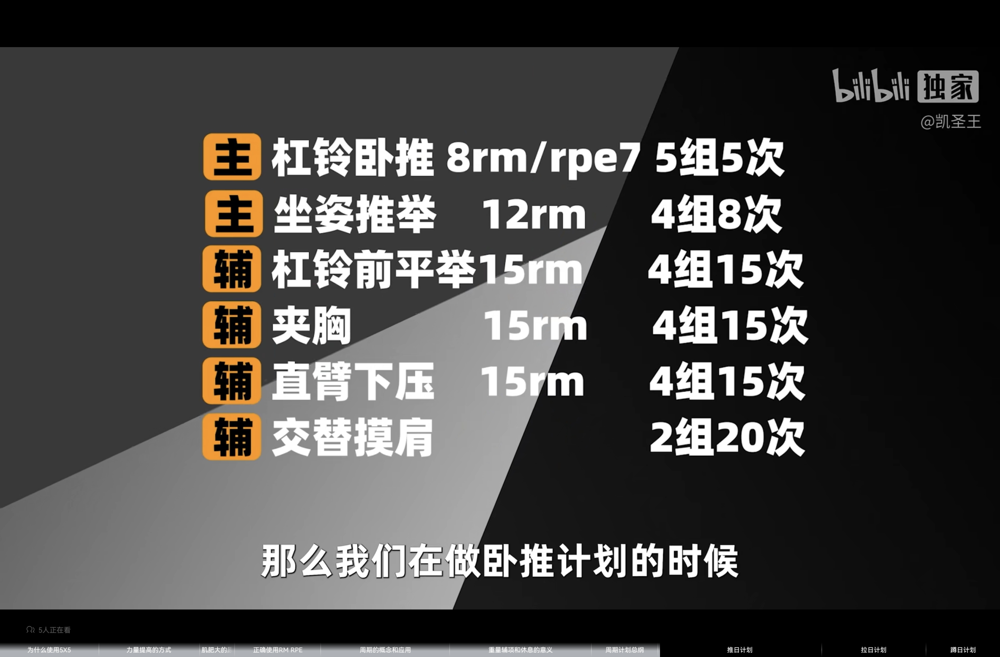

# day2 凯胜王5x5训练计划

[【新手福利】5乘5训练计划，从理论到计划到实操！！帮你省点私教费](https://www.bilibili.com/video/BV1DZ4y1y77T/?share_source=copy_web&vd_source=aff305471bcecf6ead13192265f18277)

5x5的讲究 理论依据

## 5rm偏下神经疲劳明显

4x4容量较低

6x6容量太大 不太友好

没有最好的计划 适合的计划最好

肌肉类型
骨骼肌肌肉分成两种，
白肌和红肌
白肌有瞬间的爆发力，但是难以持久
专门用作大重量强爆发无氧运动的能量
消耗，另外白肌也是基础代谢率的主体
而红肌爆发力偏弱，持久性很优异，且
能储存氧气，专门供做长时间中低强度
有氧运动的能量消耗

白肌纤维细分
i型肌纤维表现为低效率、易疲劳、有氧能力差
能快速产生肌力、肌球蛋白ATP酶活性高和无氧爆
发力强
ia和ib的主要差异在于它们的有氧氧化能量供应
能力。ia有更强的抗疲劳性，ib产生更大的张力

力量举8次一下

健美8-12次

5RM的好处
RM的划分不是那么的绝对
不是5RM是IB 6RM就一定是IA
会有交织部分的存在二者同时发力
因此5RM可以同时得到一定的力量和维度

协调性变强 -> 力量提高

神经更适应重量 -> 神经性适应

肌肉横截面积增加 第三阶段

5rm强度太大了 对神经和肌肉造成巨大负担

硬拉深蹲不推荐同一天做
单次的5X5硬拉或深蹲都已经
能引起神经疲劳和肌肉疲劳。
此时再进行深蹲或者硬拉会对
身体有极大挑战。神经和肌肉
都处于疲惫状态很难保持动作
质量并且容易受伤。

硬拉对新手不友好

训练没有周期 机械性加重量 没有辅助项目

周期是可以让人变强的 超量恢复

重复的 恢复不过来的没有意义

储备周 转化周

储备周 高频率 中等强度 控制7-8rem 不需要真正力竭

用8rm或者7rm做5次

转化周 降低频率拉高强度 8-9.5

## 加重原则

储备期 当重量变为8-7 可以加2.5kg

重量的概念

动作需要有结构

重量是检验动作质量的工具

60kg深蹲 打分100分

可能80kg 动作不及格

提高动作短板

不要盲目追求重量 钓鱼硬拉

不光要注意主项训练

需要很注意辅项训练

超量恢复很重要

# 一个月为周期的5x5训练计划

推拉蹲 3分化

前三周根据状态 练一天歇一天

刚开始训练的 练一歇一

高频的 练3歇1

主项力量

辅项可以减少，主项不能减少

