# day1_准备_自我评估

调整4大结构

什么是四大结构？

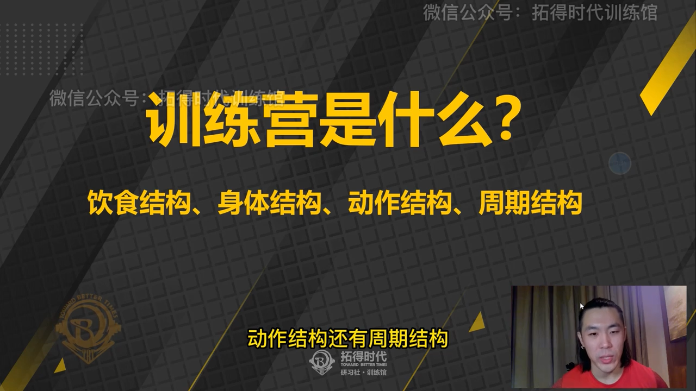

饮食 身体 动作 周期

动作日

训练计划

每日作业

## 睡眠要求8小时 最低饮水量2升

肌肉在恢复时增长

3升更好

## 饮食结构

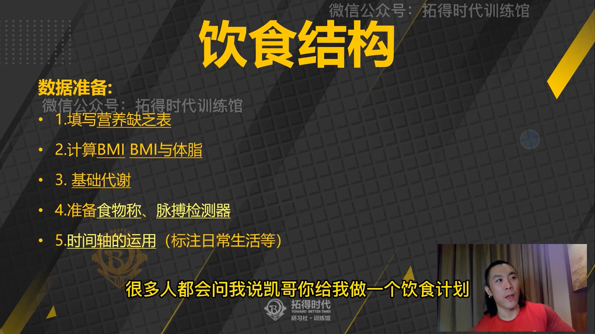

### 营养缺乏表

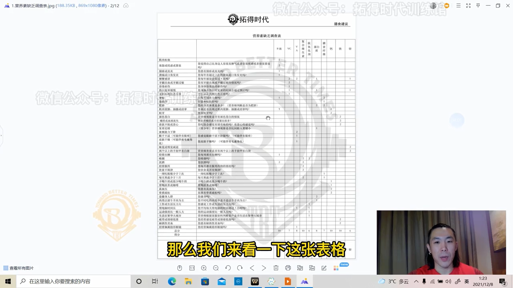

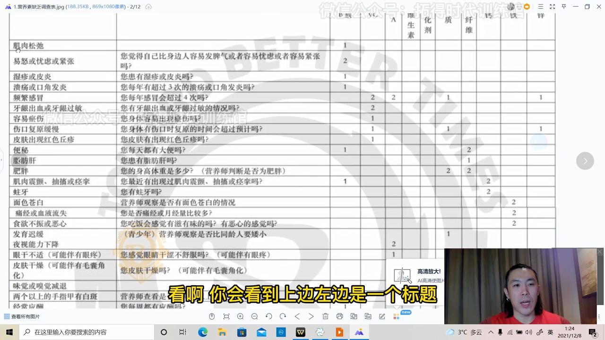

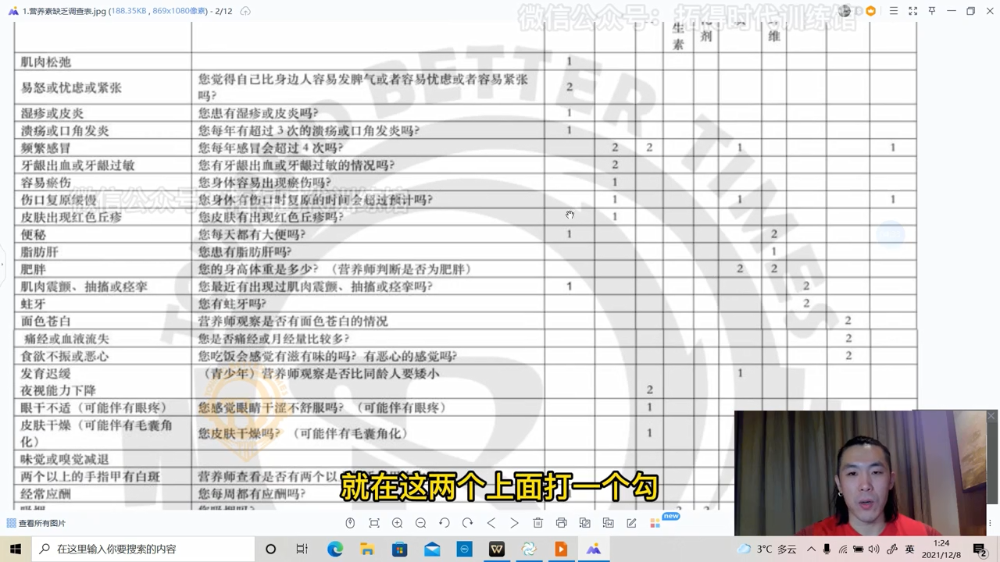

### 计算BMI与体脂

我的BMI
84/(1.85*1.85)
24.54

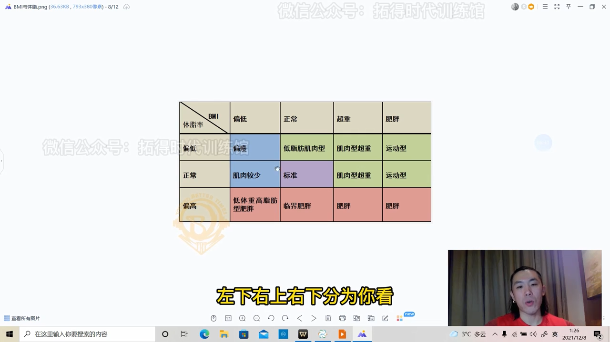

### 基础代谢

计算公式

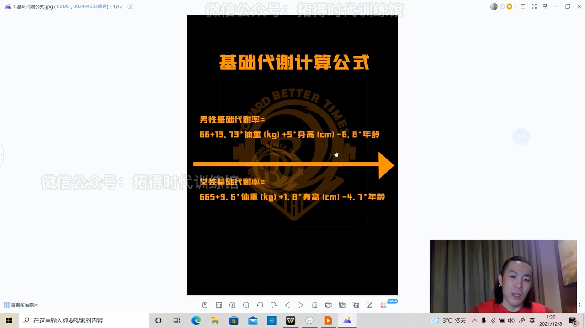

66+13.73*84.5+5*185-6.8*23

基础代谢 1994

1. 增加体表面积

2. 增加肌肉量

### 食物称 脉搏检测器

#### 食物称

对饮食进行量化

50克燕麦

#### 晨脉检测器

### 时间轴的运用 标注日常生活

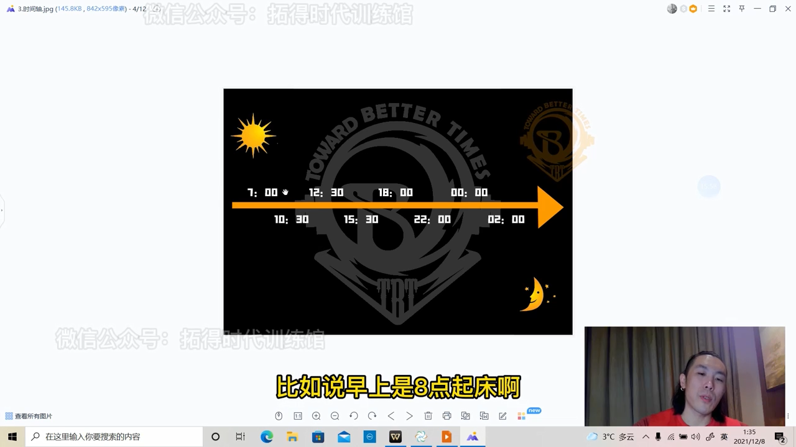

饮食参考标志 训练会直接影响身体状态

练前吃和练后吃不一样

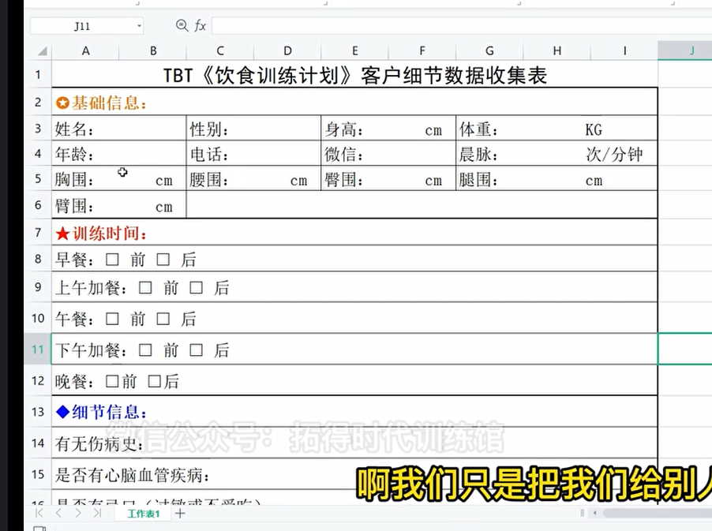

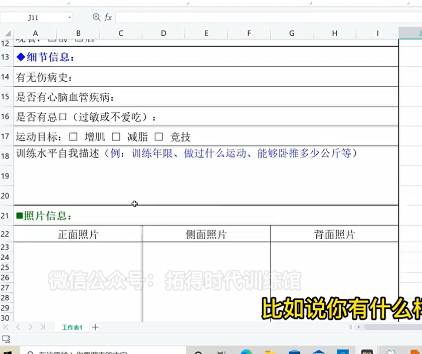

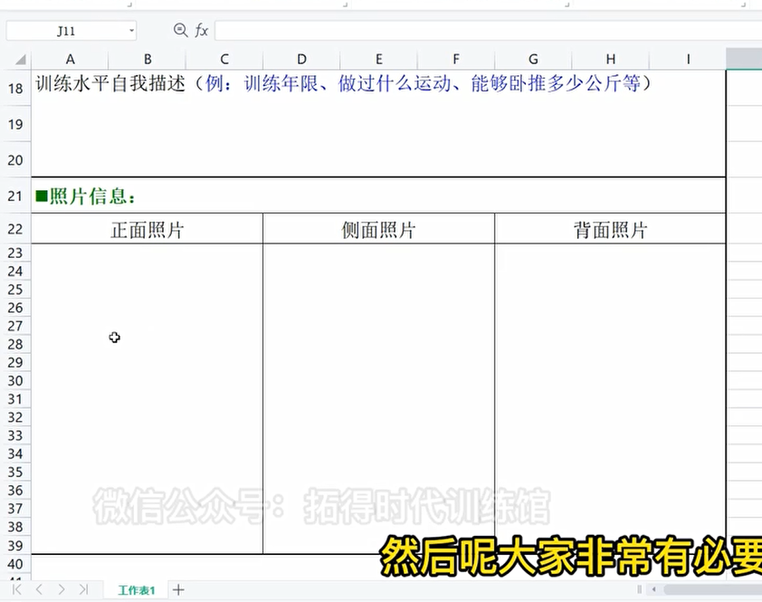

体重要早上上完厕所，空腹体重

动作结构准备

### rm力竭次数

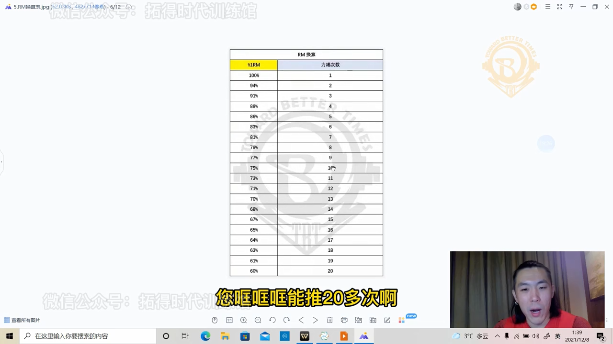

训练一年半以内不测

自我营养评估

需要补充锌元素

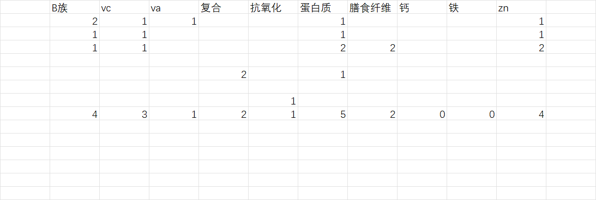