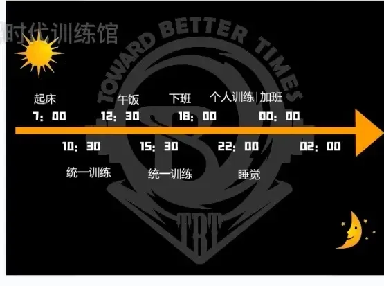
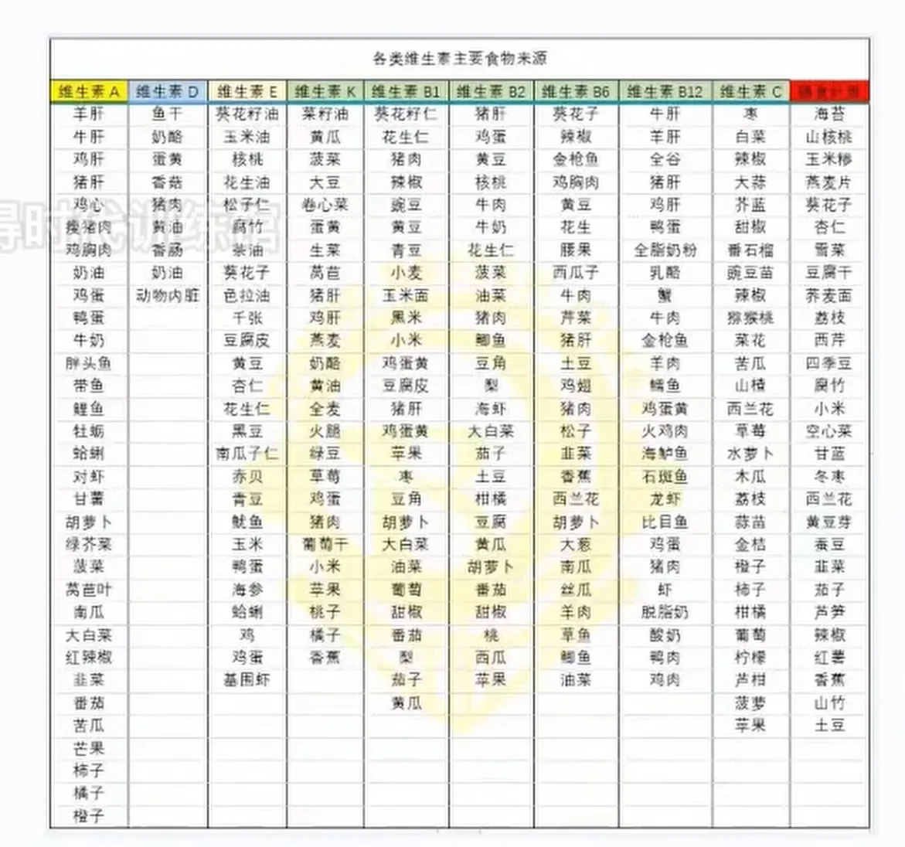
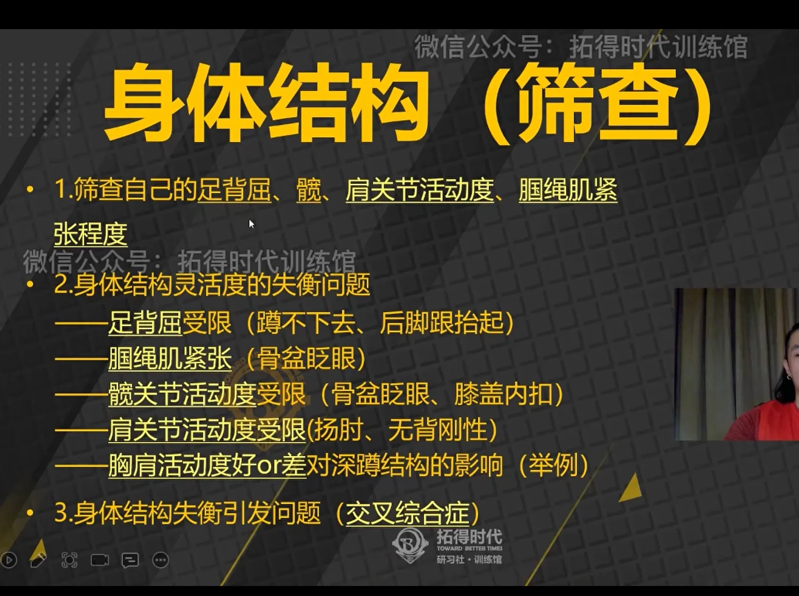
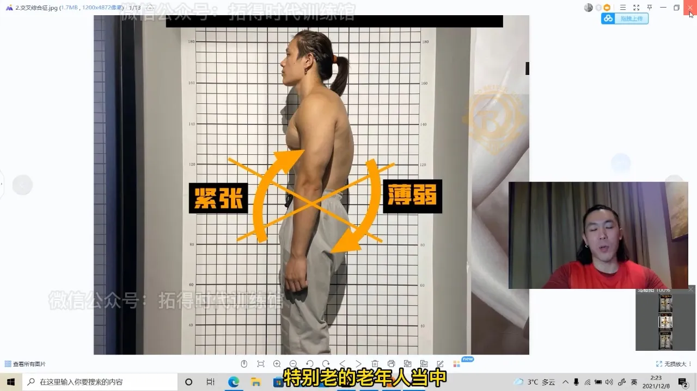
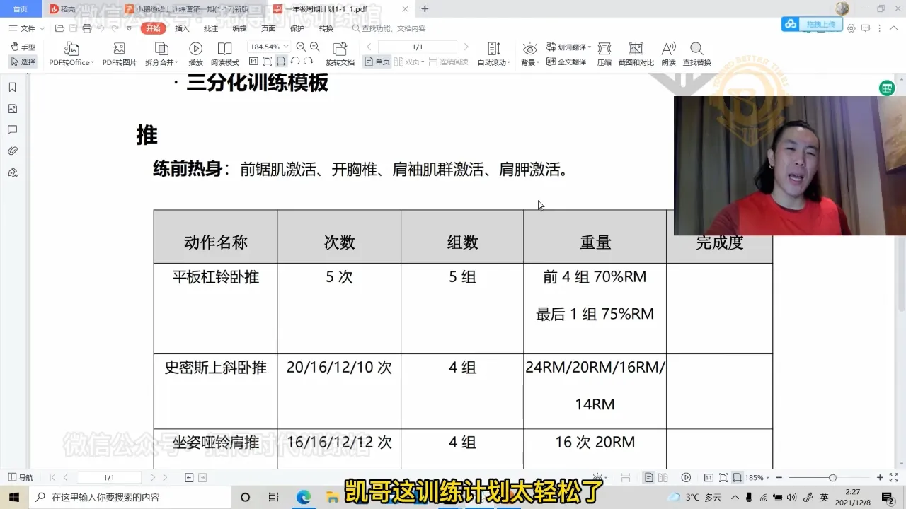
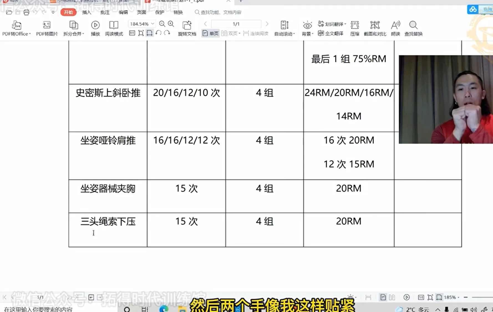
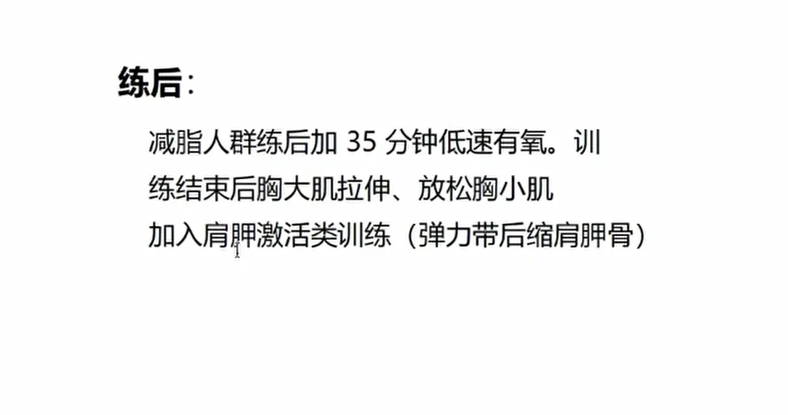

# day2_时间轴_筛查结构

非常缺少膳食纤维，会导致慢性病

矿物质缺乏

维生素缺乏

# 身体结构筛查

训练前压20分钟以上足背屈 防止步态出问题

骨盆眨眼尽量蹲高一些 不要太低 不要弯腰

耸肩可能是背部肌肉没有收紧 伤腰

骨盆前倾：

腹肌无力 屁股紧张

老年人反过来

三角肌前束 胸大肌 胸小肌紧张

## 今日三分化训练模板 练胸

储备训练计划 打磨结构

 

