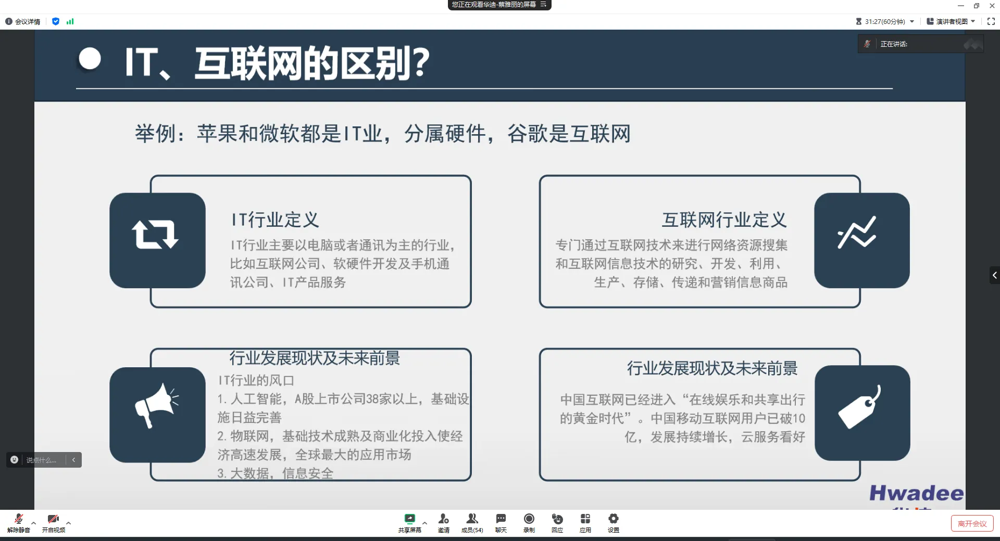

# 华迪实训day1

2024年4月8日09:07:25

qq群交流

# volar IDEA的语言服务器要使用volar

# 早会 9.30-10:30





为什么家里蹲会带来精神痛苦？ - Moxos Yuri的回答 - 知乎
https://www.zhihu.com/question/649976562/answer/3456204390

```yml
根据以上json格式的api参数, 完成js格式的axios异步请求代码, 
以post请求为例:如果json中有query参数, 按以下格式请求:"await axios.post(url, {params: data,})",
如果json中有body参数, 按以下格式请求:"await axios.post(url, data)",
不需要try catch处理异常,因为已经进行全局处理, 使用async进行异步请求.
```

http://www.esjson.com/jsonyasuo.html

```yml
根据以上json格式的http api, 完成js格式的axios异步请求代码,把请求封装成api库,每个请求封装成一个异步typescript方法, 方法名命名为类似setAdmin的格式, 封装到一个api对象中export到外部
请求格式：以post请求为例:如果json中有query参数, 按以下格式请求:"await axios.post(url, null, {params: data,})",
如果json中有body参数, 按以下格式请求:"await axios.post(url, body)",
不需要try catch处理异常,因为已经进行全局处理, 使用async进行异步请求.
```

```yml
"""

"""
根据以上java controller代码, 完成js格式的axios异步请求代码,其中的内部类已经提前定义在js中,直接使用即可,把请求封装成api库,每个请求封装成一个异步typescript方法, 方法名命名为类似setAdmin的格式, 封装到一个api对象中export到外部
请求示例：
controller的getmapping方法中的body参数
"await axios.get(url, body)"
controller的postmapping方法中的query参数
"await axios.post(url, null, {params: data,})"
controller的postmapping方法中的body参数 
"await axios.post(url, body)"
方法格式"async sendArticle(articleData: xh.ArticleSendRequest): Promise<xh.ApiRestResponse<void>>;"
不需要try catch处理异常,因为已经进行全局处理, 使用async进行异步请求.
```

标题: 在线文字压缩，去空格、换行符等 网址: http://www.wuqianling.top/software/notepad/compress.html

vscode补全属性: ctrl+.

```yml
根据以上java controller代码, 完成js格式的axios异步请求代码,其中的内部类已经提前定义在js中,直接使用即可,把请求封装成api库,每个请求封装成一个异步typescript方法, 方法名命名为类似setAdmin的格式, 封装到一个api对象中export到外部
请求示例：
controller的getmapping方法中的body参数
"await axios.get(url, body)"
controller的postmapping方法中的query参数
"await axios.post(url, null, {params: data,})"
controller的postmapping方法中的body参数 
"await axios.post(url, body)"
方法格式"async sendArticle(articleData: xh.ArticleSendRequest): Promise<xh.ApiRestResponse<void>>;"
不需要try catch处理异常,因为调用者会进行处理, 使用async进行异步请求.
不需要设置baseUrl,因为axios实例已经进行默认设置.
在生成请求后也生成测试代码, 测试代码的格式为
{const d4 = await articleApi.searchArticle('mysql', 1)
console.log('d4', d4)}
```

标题: Javascript中prototype属性的详解 - 最骚的就是你 - 博客园 网址: https://www.cnblogs.com/libin-1/p/5836082.html

prototype是存放原型属性的对象，每个对象都有一个proto属性，指向创建该对象的函数的prototype属性。

标题: 为什么是 Vitest | 指南 | Vitest 网址: https://cn.vitest.dev/guide/why.html

标题: Java泛型的协变与逆变 - 掘金 网址: https://juejin.cn/post/6911302681583681544
