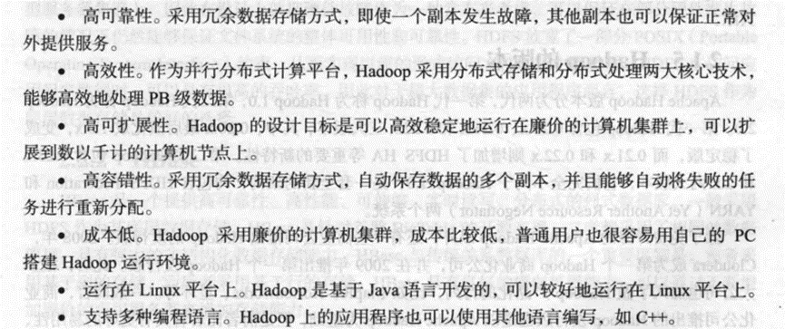
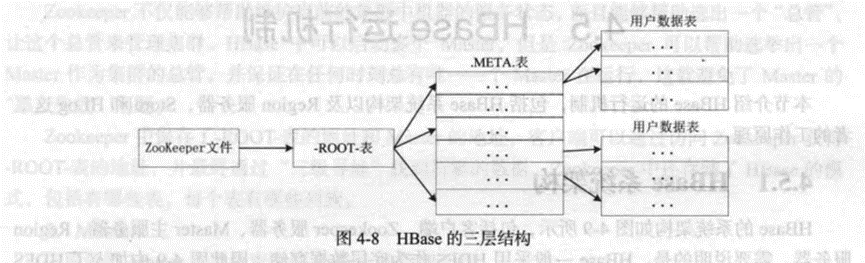

# 大数据技术原理与应用概念 第三版

# 第1章_大数据概述

## 数据产生方式经历的三个阶段：

运营式系统阶段：数据伴随一定的运营活动而产生并记录在数据库

用户原创内容阶段：web2.0 更加快捷

感知式系统阶段：物联网中的设备每时每刻自动产生大量数据

## 大数据的4个基本特征

数据**量大**volume

数据**类型多**variety

处理**速度快**velocity

价值**密度低**value

## 大数据对思维的影响

全样而非抽样

效率而非精确

相关而非因果

## 大数据和物联网的区别联系

### 第一，大数据、云计算和物联网的区别。

**大数据**侧重于对海量数据的**存储、处理与分析**,从海量数据中发现价值,服务于生产和生活;

**云计算**本质上旨在整合和优化各种IT资源,并**通过网络**以服务的方式廉价地**提供给用户**;

**物联网**的发展目标是实现物物相连,**应用创新**是物联网发展的核心。

### 第二，大数据、云计算和物联网的联系。

从整体上看，大数据、云计算和物联网这三者是**相辅相成**的。

大数据根植于云计算，大数据分析的很多技术都来自于云计算，云计算的分布式数据存储和管理系统(包括分布式文件系统和分布式数据库系统)提供了海量数据的存储和管理能力,分布式并行处理框架 MapReduce提供了海量数据分析能力，没有这些**云计算技术作为支撑，大数据**分析就无从谈起。

反之，**大数据为云计算提供**了“用武之地”，没有大数据这个“练兵场”，云计算技术再先进，也不能发挥它的应用价值。物联网的传感器源源不断产生的大量数据,构成了大数据的重要数据来源,没有物联网的飞速发展，就不会带来数据产生方式的变革，即由人工产生阶段转向自动产生阶段，大数据时代也不会这么快就到来。

同时,物联网需要**借助于云计算和大数据技术**，实现物联网大数据的存储、分析和处理。
# 第2章_大数据处理架构Hadoop

## 试描述Hadoop和谷歌的mapreduce,gfs等技术之间的关系。

Hadoo基于Java语言开发。核心是分布式文件系统(Hadoop Distributed File System,HDFS)和 MapReduce。

HDFS是针对谷歌文件系统(Google File System，GFS）的开源实现。

**MapReduce是针对谷歌 MapReduce的开源实现，**

## hadoop有哪些特性？

高可靠性，有效性，高可拓展性，高容错性，成本低，运行在linux平台，支持多种编程语言。

## 试列举单机模式和伪分布模式的异同点。

### 相同点：

#### 运行机器数相同，
**运行机器数相同**，单机(非分布式)模式与伪分布式都是在一台单机上运行。

### 不同点：

#### 运行模式不同：
单机模式是Hadoop的默认模式。这种模式在一台单机上运行，**没有分布式文件系统**，而是直接读写本地操作系统的文件系统。

伪分布模式这种模式也是在一台单机上运行，**但用不同的Java进程模仿分布式运行中的各类结点。**

#### 启动进程不同：
单机模式下，
Hadoop不会启动NameNode，DataNode，TaskTracker等守护进程，
Map和Reduce任务作为同一个进程的不同部分执行

伪分布模式下，
Hadoop启动NameNodde，DataNode，JobTracker
TaskTracker这些守护进程
都在同一台机器上运行
是相互独立的Java进程。

#### 配置文件处理方式不同
单机模式下，不对配置文件修改

伪分布模式下，修改3个配置文件，
core-site.xml hdfs-site.xml
mapred-site.xml 配置mapreduce集群的特性

#### 节点交互不同
单机模式下，不需要与其他节点交互，单机模式不用hdfs，也不加载任何hadoop的守护进程，该模式主要用户开放调试mapreduce程序逻辑。
伪分布模式在单机模式下增加了代码调试功能，允许你检查内存使用情况，hdfs输入输出，以及其他的守护进程交互。

# 第3章_分布式文件系统HDFS

## 试描述hdfs中的块与普通文件系统中的块的区别

在传统的文件系统中，为了提高磁盘读写速率，一般以数据块为单位，而不是以字节为单位

hdfs中的块，默认一个块大小为64mb，而hdfs中的文件会被拆分为多个块，每个块作为独立的单元进行存储。hdfs在块的大小设计上明显要大于普通文件系统。

## 试描述hdfs中的名称节点和数据节点的具体功能

* 名称节点负责管理分布式文件系统的命名空间，记录分布式文件系统中的每个文件中各个块所在的数据节点的位置信息。

* 数据节点是分布式文件系统hdfs的工作节点，负责数据的存储和读取，会根据客户端或者是名称节点的调度来进行数据的存储和检索，并向名称节点定期发送自己所存储的块的列表。

## 在分布式文件系统中，中心节点的设计至关重要，请阐述hdfs是如何减轻中心节点负担的

* 首先：采用主从架构，一个hdfs集群**包括一个名称节点和若干个数据节点**

* 其次是**第二名称节点**，为了有效解决editlog变大的问题，hdfs设计采用了第二名称节点，**可以完成editlog和fsimage的合并操作，减小editlog文件大小，缩短名称节点的重启时间**，**其次可以作为名称节点的检查点**，来保存名称节点的元数据信息。

## 试述HDFS的冗余数据保存策略

* hdfs采用**多副本**的方法对数据进行冗余存储，通常一个数据块的多个副本会被分布到不同的数据节点上。

## 试述hdfs是如何探测错误发生以及如何恢复的。

hdfs的错误可以分为三种情况：

### 名称节点出错

**名称节点**发生宕机(或者是FsImage和EditLog损坏)

首先到远程挂载的网络文件系统中获取备份的**元数据**信息,

放到**第二名称节点**上进行恢复,并把第二名称节点作为名称节点来使用.

### 数据节点出错

**数据节点发生故障或者断网**,从而导致数据节点无法定期向名称节点发送心跳,

名称节点会定期检查数据节点的心跳,通过数据冗余复制来生产新的副本

### 数据出错

#### 如何探测

文件被创建时,客户端会对每个文件块进行信息摘录,

并把这些信息写入同一个路径的隐藏文件里.

当客户端读取文件时, 会先读取该信息文件,

然后利用该信息文件对每个读取的数据块进行校验.

#### 如何恢复

当校验出错时,客户端会请求到另外一个数据节点读取该文件块

并向名称节点报告这个文件块有误

# 第4章_分布式数据库HBase

## 阐述HBase和传统关系数据库的区别

### 数据类型

关系数据库采用**关系模型**,Hbase采用**数据模型**.

数据模型就是**把数据存储为未经解释的字符串**,

用户可以将不同格式的结构化数据和非结构化数据都序列化成字符串保存在HBase中,

然后通过自己的程序把字符串解析成不同的数据类型;

### 数据操作

关系数据库中会设计复杂的多表连接, HBase中经常只采用**单表的主键查询**

### 存储模式

关系数据库基于行存储, **HBase基于列存储**

## 分别解释HBase中行键 列族和时间戳的概念

### 行键

每个HBase表都由若干行组成, 每个行由行键(Row Key)标识, 在HBase内部,行键是字节数组. 存储时, 数据按照行键的字典序排序存储.

### 列族

列族需要在创建表的时候就定义好, 数量也不宜过多. 列族名必须由可打印字符组成, 创建表的时候不需要定义好列

### 时间戳

每个单元格保存着同一份数据的多个版本，这些版本采用时间戳进行索引。

使用不同的时间戳来**区分不同的更新版本**。

## 试述HBase各功能组件及其作用

**库函数**：链接到每个客户端

一个**Master主服务器**：主要负责表和Region的管理工作

许多个**Region服务器**：Region服务器是HBase中最核心的模块，负责维护分配给自己的Region，并响应用户的读写请求。

## 试述HBase的三层结构中各层次的名称和作用。

1. 第一层**Zookeeper**文件，**记录了-ROOT-表的位置信息**

2. 第二层**-ROOT-表**，记录了**META**表的Region位置信息，

   ROOT表只能有一个Region，通过ROOT表可以访问META表中的数据。

3. 第三层**META**表，记录了用户数据表的Region位置信息，**META表可以有多个Region**，保存了HBase中所有用户数据表的Region位置信息。

## 试述HBase系统基本架构以及每个组成部分的作用。

### 客户端

客户端包含访问HBase的接口，同时在缓存中维护着已经访问过的Region位置信息，用来加快后续数据访问过程。

### Zookeeper服务器

Zookeeper可以帮助选举出一个Master作为集群的总管，并保证在任何时刻总有唯一一个Master在运行，这就避免了Master的“单点失效”问题。

### Master

主服务器Master主要负责表和Region的管理工作：

管理用户对表的增删改查操等操作；

实现不同Region服务器之间的负载均衡；

在Region分裂或合并后，负责重新调整Region的分布；

对发生故障失效的Region服务器上的Region进行迁移。

### Region服务器

Region服务器是HBase中最核心的模块，负责维护分配给自己的Region，并响应用户的读写请求。

## 请阐述Region服务器向HDFS文件系统中读写数据的基本原理

Region服务器内部管理了一系列Region对象和一个HLog文件，

其中，HLog是磁盘上面的记录文件，它记录着所有的更新操作。

每个Region对象又是由多个Store组成的，

每个Store对应了表中的一个列族的存储。

每个Store又包含了MemStore和若干个StoreFile。

其中，MemStore是在内存中的缓存，

保存最近更新的数据。

StoreFile是磁盘中的文件，这些文件都是树结构，方便读取

**用户读写数据的过程**：当用户写入数据时，

会被分配到响应的Region服务器去执行操作，

用户数据首先被写入到MemStore和HLog中，

当操作写入HLog之后，commit调用才会将其返回给客户端。

当用户读取数据时，Region服务器会首先访问MemStore缓存，

如果数据不在缓存中，才会到磁盘上面的StoreFile中去寻找。

# 第5章_NoSQL数据库

## 试述NoSQL数据库的四大类型

### 键值数据库

会使用一个哈希表来存储，只能通过key进行查询，从而找到对应的value，

缺点是不容易进行条件查询；

### 列族数据库

采用列族数据模型，同一列的数据会存放在一起

### 文档数据库

以文档作为数据库的最小单位

### 图数据库

使用图作为数据模型来存储数据

## 试述CAP理论的具体含义

### Consistency 一致性

所有节点在同一时间具有相同的数据。

### Availability 可用性

是指快速获取数据，可以在确定的时间内返回操作结果，保证每个请求不管成功或者失败都有响应；

### Partition 分区容忍性

（Tolerance of Network Partition）是指当出现网络分区的情况时（系统中的一部分节点无法和其他节点通讯）分离的系统也能够正常运行，也就是说，系统中任意信息的丢失或失败不回影响系统的继续运作。

## 试述数据库的ACID四性的含义

### Atomicity 原子性

指事务必须是原子性工作单元，对于其数据修改，要么全都执行，要么全都不执行。

### Consistency 一致性

指事务在完成时，必须使所有的数据都保持一致状态。

### Isolation 隔离性

指并发事务所做的修改必须与其他并发事务所做的修改隔离

### Durability 持久性

指事务完成后，它对于系统的影响是永久性的，该修改即使出现致命的系统故障也将一直保持。

## 试述数据库BASE的具体含义

### 基本可用 Basically Availble

指一个分布式系统的一部分发生问题变得不可用时，其他部分仍然可以正常使用，也就是**允许分区失败**的情况出现。

### 软状态 Soft-state

软专题是与硬状态相对应的一种提法。数据库保存的数据是“软状态”时，可以保证数据一致性，即保证数据一直是正确的。

**“软状态”是指状态可以有一段时间不同步，具有一定的滞后性**

### 最终一致性 Eventual Consistency

最终一致性是弱一致性的一种特例，**允许后续的访问操作可以暂时读不到更新后的数据**，但是经过一段时间后，必须**最终读到更新后的数据**，不是每时每刻都保持实时一致。

## 试述NewSQL数据库 传统关系数据库 NoSql数据库的区别

### NewSQL数据库

NewSQL数据库是一种新型的数据库系统，它融合了关系数据库系统和NoSQL数据库的优点，既具备关系数据库系统的ACID事务处理模型，也具备NoSQL数据库的分布式、高可用和横向扩展的特性。NewSQL数据库一般采用分布式架构，支持水平扩展，能够满足高并发和大数据量的处理需求。NewSQL数据库的应用场景主要是在线交易、金融、电商等对数据一致性和可靠性要求较高的领域。

### 传统关系数据库

关系数据库系统是最早发展的数据库系统，也是目前应用最为广泛的数据库系统。它采用表格的形式来存储数据，表格中的每一行代表一个记录，每一列代表一个属性。关系数据库系统遵循ACID（原子性、一致性、隔离性、持久性）的事务处理模型，保证了数据的一致性和完整性。由于其成熟的技术和广泛的应用，关系数据库系统拥有稳定的性能和可靠的安全性。

### NoSQL数据库

NoSQL数据库是一种非关系型数据库系统，它不采用表格的形式来存储数据，而是采用键值对、文档、图形或列族等方式来存储数据。NoSQL数据库不遵循ACID事务处理模型，它更加注重分布式、高可用和横向扩展的特性。NoSQL数据库可以用于处理大数据量、高并发和实时性要求较高的数据应用场景。

# 第6章_云数据库

## 云数据库有哪些特性？

动态可拓展

高可用性

较低的使用代价

易用性

高性能

免维护

安全

## UMP系统采用哪两种方式实现资源隔离？

<!--

用Cgroup限制MySQL进程，适用于多个MySQL共享物理机情况，可以限制CPU，内存和IOPS

在Proxy限制QPS，适用于多用户共享MySql的情况，服务器监测消耗情况，使用增加延迟方式限制用户QPS，减少用户对系统资源的消耗。

-->

## UMP系统是如何保障数据安全的？

### SSL数据库连接

SSL是为网络通信提供安全及数据完整性的一种安全协议

它在传输层对网络连接进行加密。

Proxy服务器实现类完成了MySQL客户端/服务器协议

可以与客户端之间建立SSL数据库连接。

### 数据访问IP白名单

可以把允许访问数据库的IP放入白名单，只有白名单内的IP地址才能方位，其他IP地址的访问都会被拒绝，总而进一步保证账户安全。

### 记录用户操作日志

用户的所有操作记录都会被记录到日志分析服务器，通过检查用户操作记录，可以发现隐藏的安全漏洞。

### SQL拦截

Proxy服务器可以根据要求拦截多种类型的SQL语句，比如全表扫描语句`select *`。

# 第7章_MapReduce

## 试述MapReduce和Hadoop的关系

Hadoop是基于MapReduce模型的分布式计算平台。

MapReduce是Hadoop的核心组件之一。

## MapReduce模型采用Master-Slave结构，试描述JobTracker和Tracker的功能。

MapReduce框架采用了Master/Slave架构，包括**一个Master和若干个Slave**

Master上运行JobTracker，Slave上运行TaskTracker。

用户提交的每个计算作业，会被划分成若干个任务。

**JobTracker负责作业和任务的调度，监控它们的执行，并重新调度已经失败的任务。**

**TaskTracker负责执行由JobTracker指派的任务。**

## 试述MapReduce的工作流程（需包括提交任务、Map、Shuffle、Reduce的过程）。

### 逻辑切分

首先MapReduce框架会使用InputFormat模块做Map前的预处理，比如验证输入的格式是否符合输入的定义；

然后，将输入文件切分为逻辑上的多个InputSplit，InputSplit是MapReduce对文件进行处理和运算的输入单位；每个InputSplit并没有对文件进行实际切割，只是记录了要处理的数据的位置和长度。

### 转化为Key-value

通过RecordReader（RR）根据InputSplit中的信息来处理InputSplit中的具体记录

加载数据并转换为适合map任务读取的键值对，输入给map任务

### Map处理

Map任务会根据用户自定义的映射规则，输出一系列的<key，value>作为中间结果；

### Shuffle

为了让Reduce可以并行处理Map的结果，需要对Map的输出进行一定的分区，排序，合并。归并等操作，得到<key,value-list>形式的中间结果，再交给对应的Reduce进行处理。

Shuffle将无序的<key,value>转化为有序的<key,value-list>

### Reduce

Reduce以一系列<key,value-list>中间结果作为输入，

执行用户自定义的逻辑，输出结果给OutputFormat模块。

### 输出模块

OutputFormat模块验证输出目录是否已经存在且输出结果类型是否符合配置文件中的配置类型，如果都满足，就输出Reduce的结果到分布式文件系统。

## 试分析为何采用Combiner可以减少数据传输量。是否所有的MapReduce程序都可以采用Combiner？为什么？

对于每个分区内的所有键值对，后台线程会根据key对他们进行内存排序（sort），排序是MapReduce的默认操作。如果用户事先没有定义Combiner函数，就不用进行合并操作。如果用户事先定义了Combiner函数，则这个时候会执行合并操作，从而减少需要溢写到磁盘的数据量。

所谓“合并”，是指将那些具有相同key的<key,value>的value加起来，必须，有两个键值对<\*xmu,1>和<\*xmu,1>，经过合并操作以后就可以得到一个键值对<*xmu,2>，

减少了键值对的数量。

不过，并非所有场合都可以使用Combiner，因为，Combiner的输出是Reduce任务的输入，Combiner绝不能改变Reduce任务的最终计算结果，一般而言，累加，最大值等场景可以使用合并操作。

# 第8章_Hadoop再探讨

## 试述HDFS1.0中只包含一个名称节点会带来哪些问题

### 单点故障问题

虽然HDFS1.0中存在第二名称节点，但是在1.0版本中第二名称节点的作用是周期性的从名称节点获取命名空间镜像文件（FsImage）和修改日志（EditLog），从而来对FsImage的恢复。因此当名称节点发生故障时，系统无法实时切换到第二名称节点以对外提供服务，仍需要停机恢复。（可以通过HA来解决）

### 可拓展方面

名称节点把整个HDFS文件系统中的元数据信息都保存在自己的内存中，HDFS1.0中只有一个名称节点，不可以水平拓展，而单个名称节点的内存空间是有上限的，这限制了系统中数据块、文件和目录的数目。在系统整体性能方面，整个HDFS文件系统的性能会受限于单个名称节点的吞吐量。在隔离性方面，单个名称节点难以提供不同程序之间的隔离性，一个程序可能会影响其他运行的程序。（通过HDFS联邦来进行解决）

## 请分析HDFS HA架构中数据节点如何和名称节点保持通信。

在HDFS HA中，所有名称节点会**共享底层的数据节点**存储资源。

每个数据节点要向集群中所有的名称节点注册，并周期性地向名称节点发送心跳和块信息，报告自己的状态，同时也会处理来自名称节点的指令。

## 请阐述为什么需要HDFS联邦，即它能够解决什么问题。

因为原来的HDFS存在可拓展性，系统性能以及隔离性三个方面的问题。

联邦设计了多个相互独立的名称节点，使得HDFS的命名服务能够水平拓展。

## 请阐述MapReduce1.0体系结构中存在的问题。

### 存在单点故障

系统中只有一个JobTracker来负责所有的MapReduce作业的调度；

### JobTracker负责的任务过重

JobTracker不仅要负责作业的调度和失败恢复，同时要负责资源管理与分配；

### 容易出现内存溢出

TaskTracker资源分配时不考虑内存的实际情况。

### 资源划分不合理

资源槽之间彼此不能共通使用。

## 请分别描述Pig、Tez和Kafka的功能

### Pig是Hadoop生态的一个组件

允许用户通过编写简单的脚本来实现复杂的数据分析，而不需要编写复杂的MapReduce应用程序。

Pig会自动把用户编写的脚本转换成MapReduce作业在Hadoop集群上运行，而且具备对生成的MapReduce程序进行自动优化的功能。

### Tez直接源于MapReduce框架

核心思想是将Map和Reduce两个操作进一步进行拆分，

即**Map被拆分成Input、Processor、Sort、Merge和Output**

**Reduce被拆分成Input、Shuffle、Sort、Merge、Processor和Output等**，经过分解后的这些元操作合约进行自由任意组合产生新的操作，经过一些控制程序组装后就可以形成一个大的**DAG作业**。通过DAG作业的方式运行MapReduce作业，提供了程序运行的整体处理逻辑，就可以去除工作流当中多余的Map阶段，减少不必要的操作，提升数据处理的性能。

### Kafka是由LinkedIn公式开发的一种高吞吐量的分布式发布订阅消息系统。

用户通过Kafka系统可以发布大量的消息，同时也能实时订阅消费消息。Kafka设计的初衷是构建一个可以处理海量日志、用户行为和网站运营统计等的数据处理框架。

# 第9章_数据仓库Hive

## 请分别对Hive的几个主要组成模块进行简要介绍

Hive由以下3个模块组成：

### 用户接口模块

用户接口模块包括CLI，Hive网页接口（Hive Web Interface，HWI）、JDBC、ODBC、Thrift Server等，用来实现外部应用对Hive的访问。

#### CLI是Hive自带的一个命令行客户端工具

在Hive3.0以上版本，另一个Hive命令行工具Beeline取代了CLI

#### HWI是Hive的一个简单网页界面

#### JDBC、ODBC和Thrift Server可以向用户提供进行编程访问的接口

其中Thrift Server提供Hive的对外通信接口。

JDBC和ODBC提供数据库连接接口。

### 驱动模块

包括编译器、优化器、执行器等，可以使用MapReduce、Tez和Spark作为执行引擎，当采用MapReduce作为执行引擎时，负责将HiveQL语句转换成一系列MapReduce作业。

所有命令和查询都会进入到驱动模块，通过该模块对输入进行解析编译，对需求的计算进行优化，然后按照指定的步骤进行执行。

### 元数据存储模块

是一个独立的关系型数据库。通常是与MySql数据库连接后创建的一个MySql实例，也可以是Hive自带的derby数据库实例。元数据存储模块中主要保存表模式和其他系统元数据，比如表的名称、表的列及其属性、表的分区及其属性、表的属性、表中数据所在位置信息等。

## 请简述Impalad进程的主要作用

### 协调Client（客户端）提交的查询任务的执行

### 给其他Inpalad分配任务

### 收集其他Impalad执行结果并汇总

### 另外 Impalad也会执行其他Inpalad分配的任务

# 第10章_Spark

## Spark是基于内存计算的大数据计算平台，试述Spark的主要特点

### 运行速度快

Spark采用先进的有向无环图（Directed Acycle Graph，DAG）执行引擎，以支持循环数据流于内存计算，基于内存的执行速度科比Hadoop MapReduce快上百倍，基于磁盘的执行速度也能快10倍左右。

### 容易使用

Spark支持使用Scala、java、python和R语言进行编程，简洁的API设计有助于用户轻松构建并行程序，并且可以通过Spark Shell进行交互式编程。

### 通用性

Spark提供了完整而强大的技术栈，包括SQL查询、流式计算、机器学习和图算法组件，这些组件可以无缝整合在同一个应用中，足以应对复杂的计算。

### 运行模式多样

Spark可运行于独立的集群模式中，或者运行于Hadoop中，也可运行于Amazon等云环境中，并且可以访问HDFS、Cassandra、HBase、Hive等多种数据源。

## Spark出现是为了解决Hadoop MapReduce的不足，试列举Hadoop MapReduce的几个缺陷，并说明Spark具备哪些优点。

### Hadoop存在以下缺点

#### 表达能力有限

计算必须转化成MapReduce

#### 磁盘IO开销大

执行时必须读磁盘

#### 延迟高

计算涉及IO延迟较高

### Spark有如下优点

#### 计算模式不局限于MapReduce

更灵活

#### 提供内存计算

效率高

#### DAG任务调度

优于MapReduce的迭代机制

## 试述如下Spark的几个主要概念:RDD、DAG、阶段、分区、窄依赖、宽依赖。

### RDD

是弹性分布式数据集（Resilient Distributed Dataset）的英文缩写，是分布式内存的一个抽象概念，提供了一种高度受限的共享内存模型。

### DAG

是 Directed Acyclic Graph（有向无环图）的英文缩写，反映 RDD 之间的依赖关系。

### 阶段

是作业的基本调度单位，一个作业会分为多组任务，每组任务被称为“阶段”，或者也被称为“任务集”。

### 分区

一个RDD就是一个分布式对象集合，本质上是一个只读的分区记录集合，每个RDD可以分成多个分区，每个分区就是一个数据集片段。

### 窄依赖

父RDD的一个分区只被一个子RDD的一个分区所使用就是窄依赖

### 宽依赖

父RDD的一个分区被一个子RDD的多个分区所使用就是宽依赖。

## Spark对RDD的操作主要分为行动（Action）和转换（Transformation）两种类型，两种操作的区别是什么？

### 行动：用于执行计算并制定输出的格式

### 转换：指定RDD之间的相互依赖关系

### 主要区别：

转换操作（如map、filter、groupBy、join等）接受RDD并返回RDD，

而行动操作（如count、collect等）接受RDD但是返回非RDD（即输出一个值或结果）

# 第11章_流计算

## 试述流数据的概念

从概念上而言，流数据（或数据流）是指在时间分布和数量上无限的一系列动态数据集合体；数据记录是流数据的最小组成单元。

## 试述流数据的特点

### 数据快速持续到达，潜在大小也许是无穷无尽的

### 数据来源众多。格式复杂

### 数据量大，但是不十分关注存储

一旦流数据中的某个元素经过处理，要么被丢弃，要么被归档存储。

### 注重数据的整体价值，不过分关注个别数据。

### 数据顺序颠倒或者不完整

系统无法控制将要处理的新到达的数据元素的顺序。

## 试述流计算的需求

### 高性能

处理大数据的基本要求，如每秒处理几十万条数据

### 海量式

支持TB级甚至是PB级的数据规模

### 实时性

必须保证一个较低的时延，达到秒级别，甚至是毫秒级别

### 分布式

支持大数据的基本架构，必须能够平滑拓展

### 易用性

能够快速进行开发和部署

### 可靠性

能可靠地处理流数据

