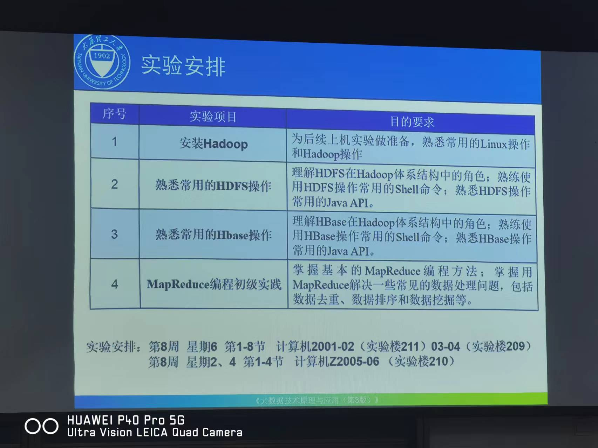
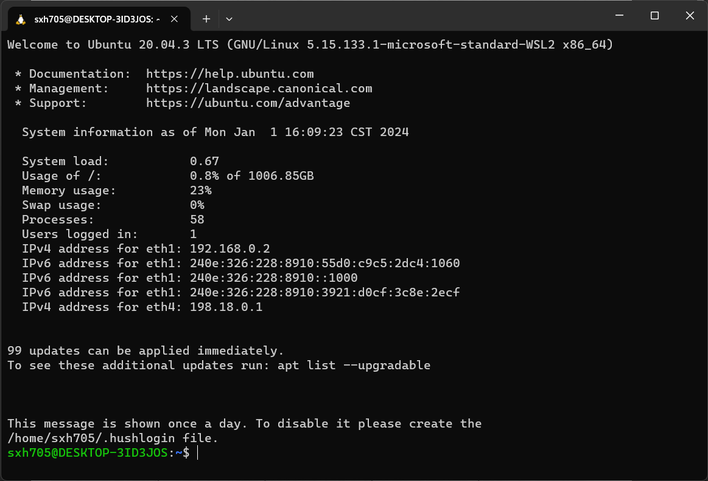
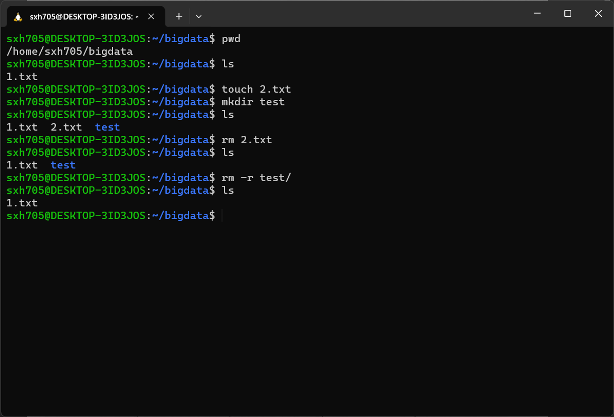

# 实验一_安装Hadoop

大数据原理与技术 p41

## 一、实验目的
（ 1 ）掌握 Linux 虚拟机的安装方法。 Hadoop 在 Linux 操作系统上运行可以发挥最佳性能。鉴于目前很多读者正在使用 Windows 操作系统，因此，为了完成本书的后续实验，这里有必要通过本实验让读者掌握在 Windows 操作系统上搭建Linux虚拟机的方法。
（ 2 ）掌握 Hadoop 的伪分布式安装方法。很多读者并不具备集群环境，需要在一台机器上模拟一个小的集群，因此，需要通过本实验让读者掌握在单机上进行 Hadoop 的伪分布式安装方法。

## 二、实验平台
操作系统：Ubuntu 20.04.3 LTS。
虚拟机软件：Windows Subsystem for Linux (WSL)，基于Hyper-V架构的虚拟机。

虚拟机版本信息

基本Linux命令的使用

