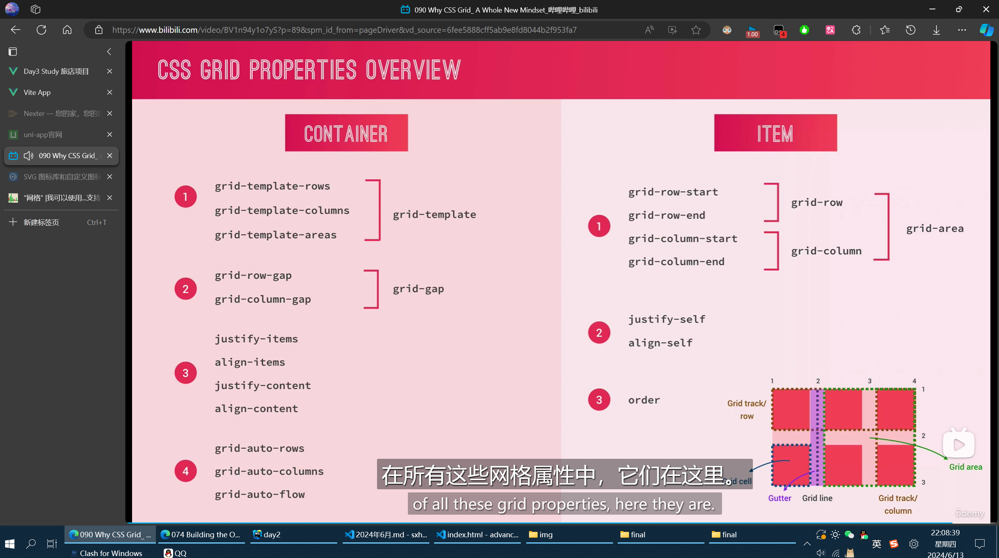

标题：Android抓包指南②: DevTools+WebViewDebugHook调试第三方应用的WebView-CSDN博客 地址：https://blog.csdn.net/CharlesSimonyi/article/details/90518367

标题：某uni-app逆向分析 - 安卓逆向 | 渣渣文 = wen's blog = 人类不适宜阅读... 地址：https://blog.wen2go.site/2022/09/05/20220905/

标题：管理云服务器 | 雨云 地址：https://app.rainyun.com/apps/rcs/77653/detail

http://38.46.31.201:25436/hosts/files

标题：抛弃React和Vue，让前端工程返璞归真 • ChlorineC的编程小窝 地址：https://chlorinec.top/post/development/front-end-without-toolchain/

标题：CSS 框架 Bulma 教程 - 阮一峰的网络日志 地址：https://www.ruanyifeng.com/blog/2017/10/bulma.html

标题：模块化(Modularity) | Bulma中文网 地址：https://bulma.zcopy.site/documentation/overview/modular/

文字居中css：

display: flex
justify-content: center;
align-items: center;

标题：Welles 的个人说明书（建设中） - 飞书云文档 地址：https://xdkkkgyt8c.feishu.cn/wiki/M7i2waqaeibrrEkCk5scxCbznTd

标题：美丽的免费图片 |Unsplash --- Beautiful Free Images & Pictures | Unsplash 地址：https://unsplash.com/

标题：免费视频片段，免版税剪辑下载 --- Free Stock Video Footage, Royalty Free Clips for Download 地址：https://coverr.co/

标题：缓动功能备忘单 --- Easing Functions Cheat Sheet 地址：https://easings.net/#

标题：立方贝塞尔（.06,1.41，.95，-0.69） ✿ cubic-bezier.com --- cubic-bezier(.06,1.41,.95,-0.69) ✿ cubic-bezier.com 地址：https://cubic-bezier.com/#.06,1.41,.95,-0.69

标题：我可以使用...支持 HTML5、CSS3 等表格 --- Can I use... Support tables for HTML5, CSS3, etc 地址：https://caniuse.com/

标题：SVG 图标库和自定义图标字体管理器 ❍ IcoMoon --- SVG Icon Libraries and Custom Icon Font Organizer ❍ IcoMoon 地址：https://icomoon.io/

grid布局

vscode emments div.header$*5

逆天行内样式。。
/*
<html lang="en" style="font-size: 17.0667px; --status-bar-height: 0px; --top-window-height: 0px; --window-left: 0px; --window-right: 0px; --window-margin: 0px; --tab-bar-height: 50px; --window-top: calc(44px + env(safe-area-inset-top)); --window-bottom: calc(0px + env(safe-area-inset-bottom));"><head>
*/

标题：Hbuilderx运行uni-app项目到Android Studio模拟器只显示“同步手机端程序文件完成”界面，不能同步界面展示 - 逍遥云天 - 博客园 地址：https://www.cnblogs.com/xyyt/p/17762475.html

标题：CSS边框生成器 | CSS可视化 地址：https://css.bqrdh.com/box-style-editor

为什么都说神经网络是个黑箱？ - Moenova的回答 - 知乎
https://www.zhihu.com/question/263672028/answer/2250289371

华为mate20pro - 处理器
麒麟980

红米k30pro - 处理器
高通骁龙865

iphone6plus 64位苹果A8芯片+M8运动协处理器

css自动换行：white-space: break-spaces;

