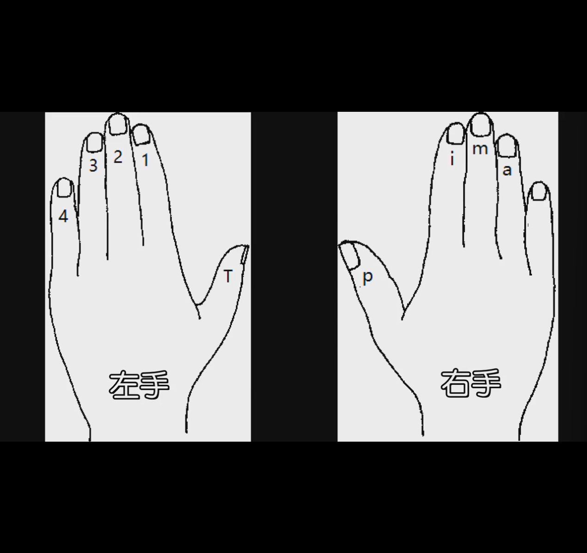
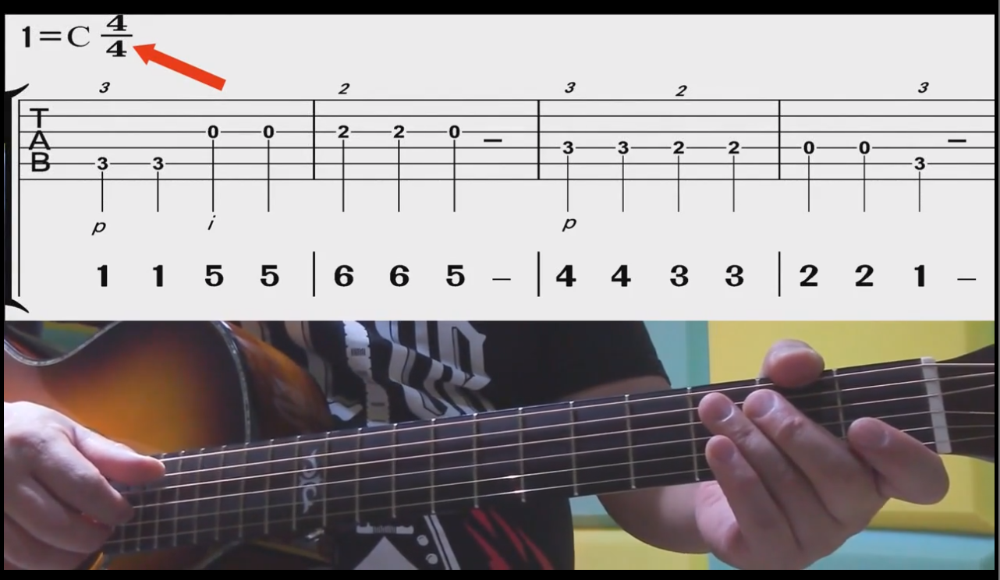

# 吉他学习

4. 认识乐谱

指法符号

左手 小拇指4 无名指3 中指2 食指1 大拇指T

右手 大拇指p 食指i 中指m 无名指a 小拇指 无

六线谱

1 = C 4/4

读作 刀=C 刀这个音是C

4/4 指的是44拍 

1155665：简谱的频率 用1-7代表do-si-do-si-re-mi-fa-sol

最上面的横线1弦 最细

最下面6弦 最粗

第一个第5线上的数字：3 

说明对应的是5弦 第3品

上面的斜体3 是左手指法 左手按住5弦3品

p 右手指法 右手p指弹响3弦

