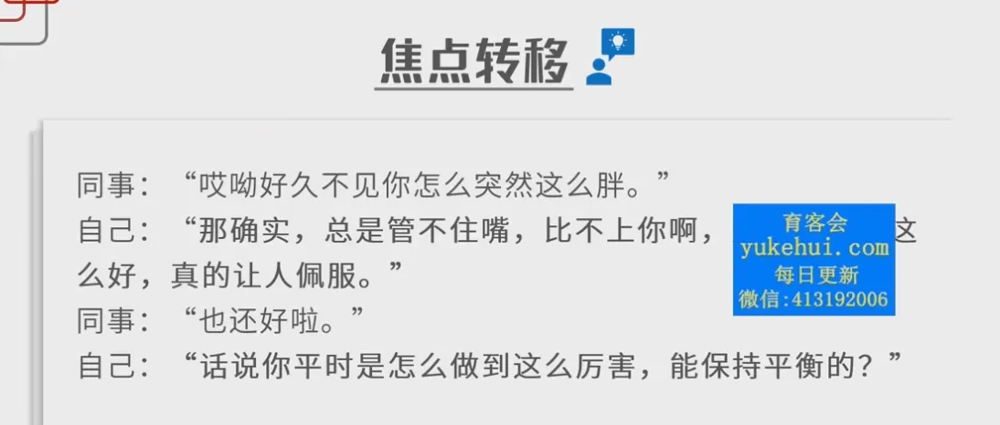
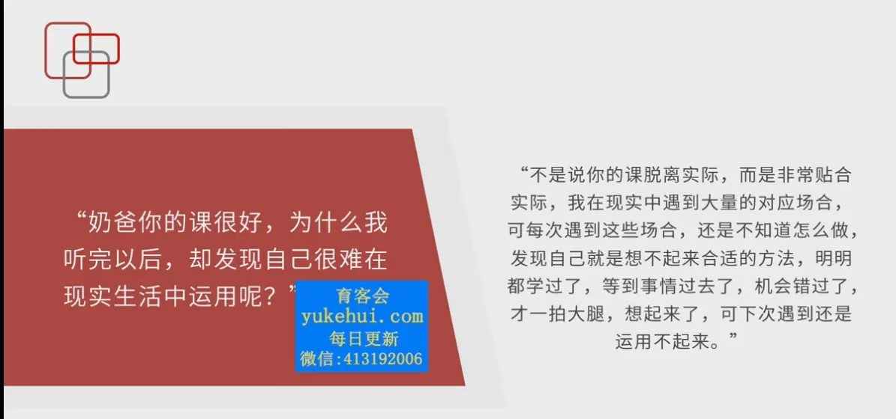
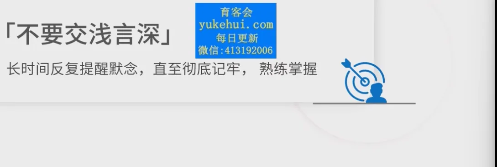
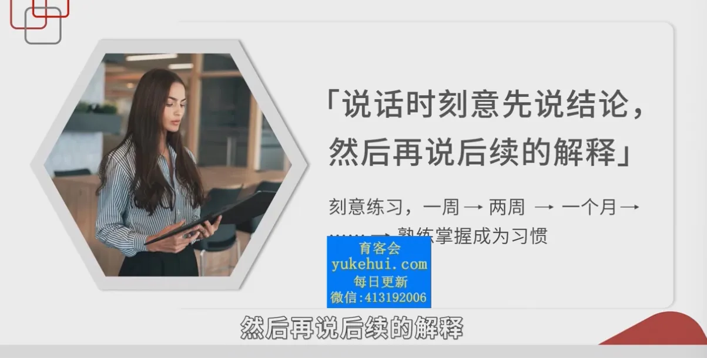
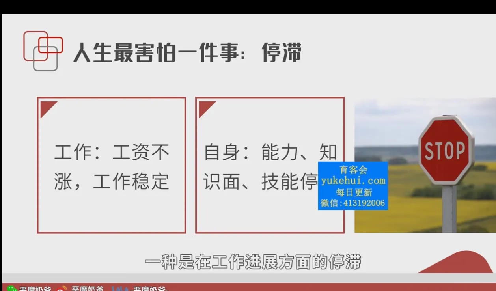

# 情商课

时光飞逝，紧张而又充实的大学生活快要过去了。在忙碌的四年中，无论是思想上还是在学习，工作上，我都收获很大。大学生活转瞬即逝，这意味着，我们也要毕业了。在大学里给我自己留下了很多值得总结的东西，下面就几个主要方面进行个人总结

在思想政治方面
我时刻不忘自己是一名共青团员，我积极向党组织靠拢，不断学习党的思想，严格遵守党的各项组织纪律，积极参与学校、学院、班级组织的各项有意义的活动。无论在思维上还是学习、行动上都坚持党的与时俱进的思想，在不断更新自我知识的同时紧跟党的前进步伐，争做时代有用人才。

在学习实践方面
我积极学习学校的课堂知识，大学四年期间没有挂科记录；大一通过大学英语六级，担任班级心理委员，负责关注班级学生的心理健康状况；大二学习软件开发的常用工具和开发流程，同时在课下时间学习企业中常见的最新知识，为以后的工作做准备；大三学习了数据库的原理和使用，并在课下时间学习使用 Java 进行 Web 开发；大四上学期，我实践了自己学到的知识，作为程序开发的身份，参加了互联网加竞赛，获得了省级铜奖；到了大四下学期，我积极参与到学校组织的生产实习中。在实习中，我熟练掌握了使用 SpringBoot 和 Vue 开发传统 Web 应用的流程，也了解了企业中项目生产的规范流程。

在平时生活方面
我同样以一种虚心向学的姿态，向身边优秀的同学学习。在与很多同学接触的这四年时间里，我也懂得了很多生活的乐趣，我们一起谈笑风生，快乐无比。我们相互帮助，不让哪个同学落单。这些，都让我感到家一般的温暖，让我学会了感恩。在社会实践方面，我喜欢利用假期时间，去做一些兼职。我觉得，校园只是我们社会的一个缩影，要真正的得到历练，我们还必须走出校园，走向真正的社会，在这样的环境下，我们方可历练自己。学会吃苦，学会容忍，学会微笑，学会谦让。这样的我们才能立足于社会的不败之地。

经过大学四年的学习，我在思想，学习，生活等方面都取得了长足的进步，但是也清醒的认识到自己的不足之处，在未来的日子里，我要努力提升自己的能力，不断学习新的知识，不断提升自己的综合素质。在以后的日子中，为社会做出自己的贡献。

如何成为杰出的程序员或软件工程师？ - 老污龟的回答 - 知乎
https://www.zhihu.com/question/19636213/answer/3503296866

有哪些越早知道越好的人生经验？ - 来自星星的星的回答 - 知乎
https://www.zhihu.com/question/266090769/answer/892855217

任务

弹琴


当前 17.00

17.00-18.00 学习情商课 记笔记 喝水

买菜 18.00-18.30

做饭 18.30-19.00

跑步 19.00-19.30

吃饭 19.30-20.30

情商课：

正式合作期 加强沟通

刚进去 不要表现

上下级关系：同盟关系

加强沟通

多与上级沟通 多说几句

领导不知道团队的积极情况

别人看到我就像溜走，只有这个人在积极汇报，非常投入

不主动汇报=把机会让给别人

如何沟通？

## 情绪价值

练习同级、低级 保洁大妈 实习生 同事 爸妈 家里亲戚

夸上司 拍马屁

夸朋友 彬彬有礼

上下级一起夸 有礼有节

夸亲戚 良好家教 谦谦君子 有礼有节

## 工作价值

记住一点：把结论和观点放在第一句

1. 汇报工作进展：

“这件事我已经盯了一个月了。。。。。真是太难了老板” 你想表达什么？

“一家供应商给出了明确反馈。。。。真是太难了老板”

难不难累不累不用说。。

解释抱怨牢骚论证讲解放在后面，找清关键词

建立新的表达习惯

用不习惯的手刷牙吃饭

专注敏锐努力刻意坚持注意练习

# 6. 同事相处

## 一、为什么同事关系让你特别痛苦？

不是很重要 1%

上下级关系搞好了，同事关系就是小菜一碟

别人：有马屁精，看不惯但是不能摆平

马屁精：我是唯一一个能力强的员工，但是有小人看不惯

在意别人的废话

## 难点1：认知和心态

把同事关系看的过于重要 甚至要交朋友

## 难点2：性格的坚毅和毅力

理智上知道要远离的人，总是控制不住自己的在意和交流

不敢正常表现。坚毅不足

一个人的意志力和品质以及认知，主要由目标决定。

目标：2%个人条件 98%客观环境

## 问题：上班到底是来干啥的？

企业内：不升职 出局 目标：努力升职

企业外：工作稳定 目标：安稳工作

上班梦游，不知道自己干什么的人，才会感到纠结和痛苦

别人喜欢不喜欢你没有意义

同事关系的核心本质：

## 二、为什么表面客气的同事暗藏心机

1. 人性上的恶

见不得别人好 曲意逢迎 躲避 打压 随口批评 说为了别人好

2. 人性的糊涂与妥协

对亲近的人好，对外人提防

领导开明 互帮互助

公司糟糕 互相踩踏

没有个人原则 糊涂

3. 具备利益上的一致与合作 2%

98%大部分情况是一个倒霉蛋干了大部分工作、所有工作

利益被分 刁难冲突

4. 实际利益的的竞争与互害

同学关系 情绪 心理 感情欺软怕硬 感性上打压

情感态度语言交谈 比较虚

同事关系：实际利益

加工资：蛋糕是有限的 给你加工资 升职 别人就没了

绩效评比和奖金发放 大部分人大学没有实际利益

但是工作评比 真实会分钱

别人是很多个 总有人会恨你

### 断人财路如杀人父母

你管不了别人怎么想

存在竞争关系

和奖学金不一样和亲戚攀比装逼不一样 真实利益

情感只是吵两句气两下

怪话酸话 打压 小报告 陷害 弄虚作假更多

一般人不知道

职场有明确利益竞争，斗争空前激烈 你死我活

表面都想做好人，但是潜意识都是互相陷害，弱肉强食

1. 坏人都很虚伪，仁义道德

2. 但是所有人都坚信自己是大好人，哪怕自己真的做了罪恶滔天的事情，但是反而会找借口，我也是苦衷，我是一片好心，我是无辜的。

## 三、为什么面对可怕的人，你还是如此软弱？

《律师本色》

主管，你能不能nice一点？

nice完成不了工作

社会不是温情脉脉讲究团结，而是充满竞争，尔虞我诈

要去打败击垮别人

be aggressive 

强硬，寸步不让

坚决不和稀泥

坚决不动摇

人是软弱的 他人会哭，会示弱，会表演

做到aggressive非常不容易

需要从小到大的教育灌输

微博投稿：给单位递送材料，被保安欺负。

人性中的强硬的天生的，要正面应对别人。

在有成本，有后果的环境中，做自己

四大名句：来都来了，人都死了，大过年的，孩子还小

软弱，不敢为自己利益发声的人

关注利益，关注自我，计较得失

极度利己，斤斤计较，嫉妒他人

## 四 为什么同事会阴阳怪气 恶心你

聚餐看到你 为什么你长这么胖？我是关心你

他完全意识不到自己的错误 从小收到的教育是要对别人好

但是潜意识任务外界是竞争对手

显意识：要团结要体面宽容忍让

潜意识：要激进，要凶狠

潜意识和显意识的矛盾：

小人和领导关系好

潜意识：做有利于自己的事

显意识：注意风度，不能吃相难看，要注意团结，不要让周围人不开心，要在意他人看法，做好好先生

人性是自私的，在利益面前，道德不值一提

不去提升上下级的沟通

冲突矛盾：尖酸刻薄，阴阳关起，人不人鬼不鬼

弱肉强食：公平决出胜负

阴阳怪气：每个人争当道德楷模，讲你的错误

## 五、如何树立正确认知？

潜意识 的真实的 不一定是全部正确，短视，鼠目寸光，没有规律，让人死得快

显意识 是虚伪的 但是维持着社会的正常运转，遵守规则才有长远发展

大方坦诚接受自己内心的隐含思想和想法

用自己的思考认真鉴别，哪些可以做，哪些不能做，哪些做不到，哪些不清楚

赚钱 升职加薪 风光 空余时间；合理的

见不得别人好，需要所有人宠着你让着你 不可能的 有毒有害的

不要因为别人的评价放弃

树立最高指导原则：上班是来追求利益的

职场上的客观规则，催生了潜意识

通过潜意识调和，得到本质目标

有利于实现目标 多做

不利于实现目标 少做

对实现目标不影响 无需放在心上

be nice有益的时候 be nice

be nice不利的时候 be aggressive

职场目标：完成工作 达成发展

## 六、如何处理好复杂险恶的同事关系

1. 工作一定要留痕

事实的第一位的，是职场的立命之本

工作一定留痕 凡事留下文字 照片证据 

工作邮件 协作软件 钉钉

微信 工作群

留痕重点：

不接受口头要求

1. 对方费事：要求对方写清需求，邮件发给自己确认

2. 你费事：将对方口头需求写成文字 邮件发给对方确认

让对方回复确认

时间 地点 事件 人物 预算 截止时间

重要的管理人际关系，识别鉴别别人的重要工具

调教不好：对方有问题

同事有任何于要求，一定要麻烦对方写邮件给自己

对方发脾气：对方是一个卑鄙小人，想要陷害自己

不能因为对方不高兴而屈服，而是以后不搭理

领导口头要求

1. 立刻写成重要信息文字，发给领导确认

让我们的配合更加高效，清楚，透明，事后复盘省心省力，

何必为难我一个底层小朋友

2. 培养领导的工作习惯

工作要留痕是真理，就像万有引力一样正确

不管是什么类型的办公桌上班都是真理

不遵守工作留痕：包藏祸心 让你顶锅送死

非暴力 不合作态度 您没回复确认，我认为不需要做，不敢僭越

2. 尽可能对外界保持礼貌和客气

必须同事配合 但是他不配合？

同事配合你工作不是应该的，配合是极少数

配合两字弹性空间很大，对方报销就拖半年，公司规定，没有理由

供应商回访，拖3个月 

看的不是公司规章制度，看你和他关系

持良好的关系和态度有利于同事配合

主动和人打招呼，礼多人不怪

3. 把你的同事分类

不同的态度不矛盾

一般人：熟悉的 不熟悉的

我们：工作能力强 不强 搞好关系有利的 搞好关系没好处的

对小人强硬不客气 对好人，重要人，影响工作人：客气

4. 红白喜事要不要参加？

不要去多问，麻烦

要不要参加？看环境氛围，环境是流动性的，不去

环境特别稳定，考虑参加邀请，正常人情往来

随礼 AA 形式不同 防止别人占便宜，促进人情往来

5. 同事之间能不能谈恋爱

 上班来干嘛

 最重要是什么

 是否有利

 是否有害

 害处？

6. 鼓励办公室谈恋爱怎么办？

职业素养难题

20 精力完成工作

80 精力应对没有职业素养的傻逼同事和上司

职业素养两类：

一、客观真理

工作留痕

二、主观真理

内部消化，办公室恋情

    对自己有影响

    对公司没害处

3成鼓励内部

3成不允许办公室恋情

3成无所谓

大方宣称同事是我的家人朋友

对外宣称自己不是单身

# 7. 总结 如何全面提升个人职场表现与竞争力

# 总问题

1. 如何梳理职场目标？

目标由工作性质的现实决定

单位；稳定 很难发展

公司；焦虑 up or out

2. 如何确定合适的应对策略？

## 办公室

1. 三个阶段

入职

试用期

正式工作

2. 两类人

同事

上司

## 如何在复杂人际关系找突破口？

1. 同事季度自己 感到非常生气 怎么办？

置之不理 该做什么做什么

拉踩 阴阳怪气 

对自己的现实几乎毫无影响 该工作工作 该升职升职

但是还是会气到 自己影响自己

应对这些问题：跳进粪坑和蛆搏斗 把自己搞臭了

目标决定坚毅 坚毅决定情绪 情绪决定行为

是收拾不顺眼的人？还是来工作挣钱的？

认清现实 你越优秀 嫉妒你的人就越多

同事不断造谣影响到工作了？

已经影响到工作了 在公司声明，宣称，当面对质，打压

工作基本规则：上级为先，

自己可以控制的地方，尽量修改

自己无法控制的地方（工作能力强，有成绩被嫉妒）

公司对你嘉奖 管我屁事 这些小人不好

## 如何快速判断用什么策略应对小人？

小人阴阳怪气，说坏话，脏话？

你上班是来做什么的？

工作 or 应付同事？

处在重要部门？不能骂他



对于 毫无价值的同事？

不需要巧妙回怼 用高深的方法精力

彻底无视 不要浪费时间

可以走就走，没法办？打开手机听歌，刷手机玩

如果大声招呼？会放弃

如果继续大声招呼？不好意思，上司找我有事，我得先处理，您自己有什么事情可以自己先去玩。

## 为什么你只能知道却无法坚持做到？

吃打不吃记

明知道身边有小人传坏话，但是传零食，买奶茶立马接收，下班一块回家，平时一块闲聊，空闲时间一起上厕所，都完全ok？

没有脑子，没有记忆力，不能冷漠绝交？

为什么没有坚定？

不清楚自己上班是来干什么的。。

渴望朋友 友情 陪伴 感情 融入 集体 受欢迎 被喜欢 -> 屁也不是

任何一种特别有效的方法，基本要求：使用者冷静 镇定 勇敢 坚强 坚定

自我意识过剩 沉迷于自我情绪 可是我社恐怎么办 我性格内向这些都是天生的 我真的做不到啊好难 

现实决定目标 目标决定品质 品质决定情绪 情绪决定行为

现实中遇到所有问题都会被你彻底忘掉

很多人，领导，大领导都会犯这个错误。。

幸运的尸体。。。大学学历高，运气好，按照上司和团队评价做事，提升别人对自己的评价。。工作遇到好上司，好团队

尸体，职业生涯死掉了，不知道自己的真正目标，会有无法适应身边人的评价的情况，随着年龄增长，改变自己越来越难

举个例子

朋友，公司技术总监，领导关系好，同事有爱顺利，认为人之间有真感情。持续到他决定要离职，看看真正的世界，下家开得更高，领导不是兄弟，当实习生动不动训斥，公司上下都说他能力低下，没有任何作用，认为他没有好的前途，人品不好，怀疑自己得了抑郁症，

帮公司攻克了很多艰难的项目

根本原因：他没有认清现实，不懂职场基本规则，没搞清楚上班到底来干什么

上班是工作，是冷静追求自己的利益，不是保持团结友谊

有利用价值 -> 情感好

没有利用价值 -> 情感破裂

离职 -> 陌生人 -> 敌人

必须赶快打压和摧毁。。

同事也在看老板的态度，一起打压你

人和人的关系就是这么残酷的？

亲人朋友 真感情

上班？赚钱 不是谈感情

公司中：利益：所有感情的基础

自己提离职，老板立马答应，自己心里不是滋味

被领导讲两句 畏畏缩缩，失去积极性

上班到底是来干什么的？麻烦认清办公室的现实！

## 明明学会了，但是关键时候用不出来，想不起方法。。

如何科学练习，让学到的技巧快速用出来？

职场技能是必备技能 几乎人人都可以掌握 

你可以不喜欢 可以不做 但是不能不学 不懂 不会

不要妄图立竿见影 迅速提升改变

5分钟立刻就不紧张了，完美适应，良好处理。。

看了 != 学会了

学会了 实际情况：还是不知道怎么做 事后一拍大腿

解决办法：

对于自己做不到的事情：提高重视程度：

不要高估自己，不要低估事情的难度



不会用的关键：不重视 急于求成 急躁 没有耐心

学一遍会用的人：天才 身经百战的高手

提升表达能力关键：

大量练习实践

每天早上一小时，即兴演讲，录音修改

为什么不能提升：

没有重视，低估了事情难度，对事情没有正确认知

知道 -> 练习 -> 做到

正视事实：严重缺乏练习

一切的实用技能 都需要 大量的练习。







## 如何低风险的提升自己的职场技能？

失败的原因：

讲了和领导同事相处的技巧，把领导得罪了

试错空间和容错率

职场发展 哪怕是天才也需要练习

上级给我分配了最差的岗位？

单位给我分配工作 挑自己最想干的

借调 没法给准确的意见和态度

一切服从上级安排

职场类似足球，篮球，网球

直接拿同事练手 不要

可能会让你寸步难行

严重后果的原因：缺乏练习

缺乏练习是无意识的结果

我应该分享吗？破冰，融入团队，打成一片

成为了天大的难事

主动打招呼 不熟了人

平时开朗外向->随意实践运用课程

如果内心戏太多->换一个低风险场合练习

朋友，亲人，亲戚（√）

花钱请同学吃饭，亲自邀约

邀请讨厌的亲戚来家吃饭

班里请同学吃零食，吃奶茶

面对一屋子陌生亲戚，礼貌得体的打招呼 某某阿姨 某某叔 某某婶婶

心平气和和爸妈交流

面对讨厌的亲戚礼貌对待

离开家了？成年人的，要不要听亲戚朋友？这是你的自由

你就算忍不住生气了，也可以再次锻炼，练到忍得住为止

得罪亲戚，大家不会说什么

得罪同学，也没关系

大家都说你变了

成长懂事，不是吧傻逼们的意见当真，按照傻逼的意见行事，而是喜怒不形于色，口头应付，让傻逼觉得你舒服，有礼貌，心理不较真，拿得起，放得下，记不住，不分析，不在乎，尊重彼此的不同，不把事情当真

家里人都无法搞定，怎么去征服世界！

## 大家好好加油 

祝大家未来工作开心 升职加薪。 

# 自我介绍

姓名 工作 成就性事件 使用数字

恶魔奶爸 自媒体人 100万粉丝 十大影响力大v

如何包装？

工作枯燥 没有价值 ？

哪怕一张卫生纸 一条内裤 都有价值

我叫xx 暂时无业 过去五年 努力战胜抑郁症 有与症状相处经验 减轻大家的压力

好好准备 苏欣昊 太原理工大学 ccf 前10 四六级 如果大家有计算机软件方面的问题，大家可以

## 放松自我介绍

朋友聚会 相亲 谈恋爱 说话 严肃 老土

讲数字没有格调 兴趣爱好主 工作为辅

业余爱好 运动健身 看书 交流历史

姓名 工作 兴趣爱好 不需要提及工作成就

兴趣爱好交友

社交目的：场合的判断基准

判断我们这场局的目的

人和人的关系是主观的

如果这是一个放松party 但是你要展现价值 

我是算法天才？

爱好国学 玄学 爱好武术？

提前修改好自己的自我介绍

可以价值交换：正式模版

成就数字 练习时长两年半 

# 高发沟通场景

## 手机社交 浪费自己的时间精力

手机沟通形式

微信 邮件 电话 短信

你希望别人怎么对你？

### 重要的事情不要用微信来说

能够快速打个电话 还是微信聊半小时

要求我们自己

### 打电话

我是谁谁谁 什么事情

1. 先互相称呼 老李 

2. 你现在有时间吗？你现在方便讲电话吗？

微信浅层社交 第一句话在吗？

#### 微信直接发重要信息

#### 电话先问有空没有

### 3. 不要群发祝福信息

祝福信息 公害

祝福信息 不产生好感 认为烦人

自己觉得烦人 逢年过节 拜年环节

希望得到的祝福：重视和尊重 不是群发的

加上对方的名字 可以每个人祝福信息一摸一样，但是前面加上名字

老李，祝你新春快乐

发个红包？

我们对于重视的人、有恩惠的人，可以发个红包，

没钱发红包，懒得发文字

可以发朋友圈 值此佳节，不骚扰大家了

### 少聊微信

微信是个低价值渠道 

看书 运动 工作 思考冥想

线上成交 微信销售

聊微信是工作 不说了

### 非要微信聊天，发文字一定要加标点

尽量不要发长语音

陌生人，发了二三十条40秒以上的语音 没有尊重

1. 直接打电话

2. 微信预约打个电话 讲5分钟

3. 朋友 有空喝杯咖啡 约一下

一种情况 不发语音 我现在不方便打字 打电话

现在方便吗


# 应对长辈 老人

如何更好地去应付老年人

凭什么我要应付？

现在的年轻人都胸怀天下

人际关系井井有条

村的二叔三舅搞不定？

案例：有的人恐惧比自己地位高的老总

社交永远是个练习

投篮永远有进步空间

## 第一原则：笑嘻嘻

笑：热情好客的第一印象 说好听的话

wsl启动warnhole：liveservice 

```sh
sudo ./browservice-v0.9.9.1-x86_64.AppImage --use-dedicated-xvfb=NO --vice-opt-http-listen-addr=0.0.0.0:80 --chromium-args=no-sandbox
```

.\browservice.exe --vice-opt-http-listen-addr=0.0.0.0:7070